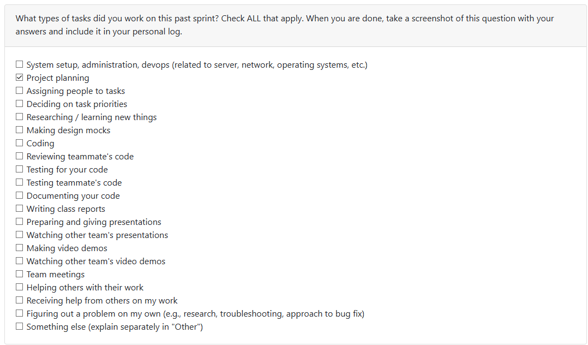

# Om Mistry (@OM200401)

## Week 3: September 15 - 21 

*I worked on adding the functional requirements in the project requirements document alongside coming up with some ideas for the non-funcntional requirements. I also added the usage scenario and target user group for the project as well. I setup some starter directories and files for our documentation and log setup.*

