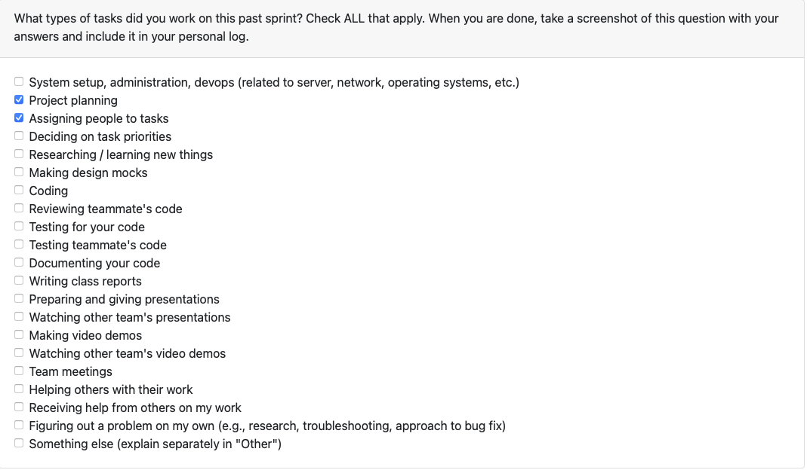
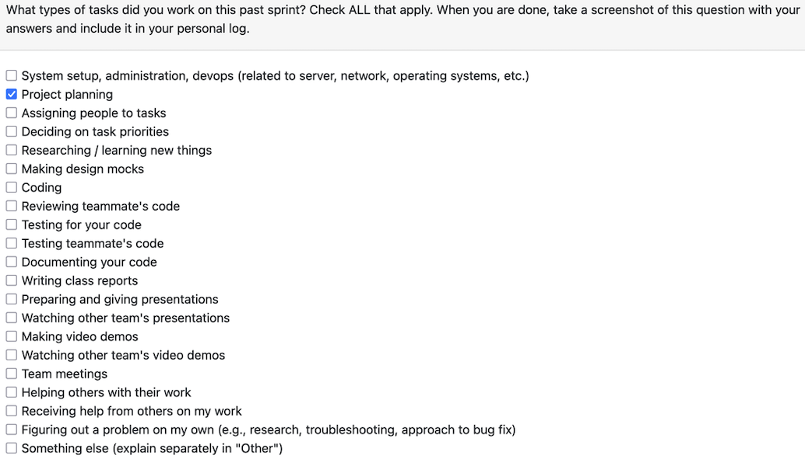

# Samarth Grover (@Samarth-G)

## Week 4: September 22 - 28

This week I worked with my team to brainstorm and iterate through the System Architecture Diagram. We first settled on a more information heavy diagram but later pivoted to a more visual diagram that was easier to understand, while using the older diagram as a reference for a detailed component breakdown. I also worked on the Project Scope and Usage Scenario section of the Project Proposal to layout the concrete outline for what our project aims to achieve. 

## Week 3: September 15 - 21 
This week I worked alongside my team to set up the foundation for the project including the git repository and docs setup. We discussed the project overview and wrote out the functional and non-functional requirements by going in depth and understanding what was needed to build the project.

Missed lecture due to sickness during this week.

