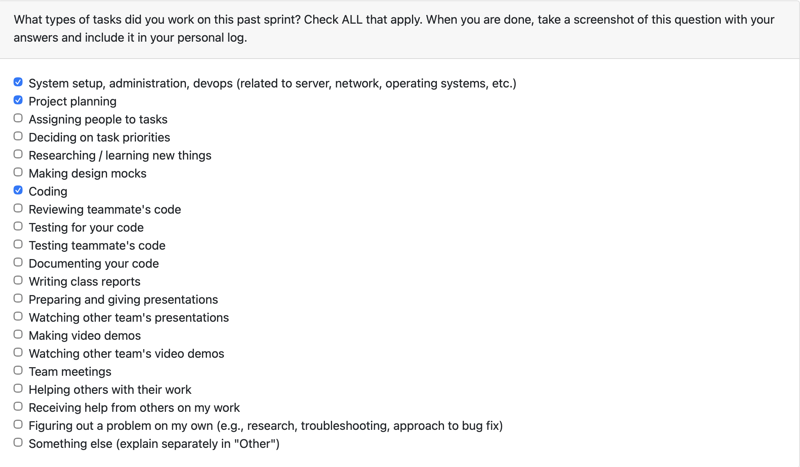
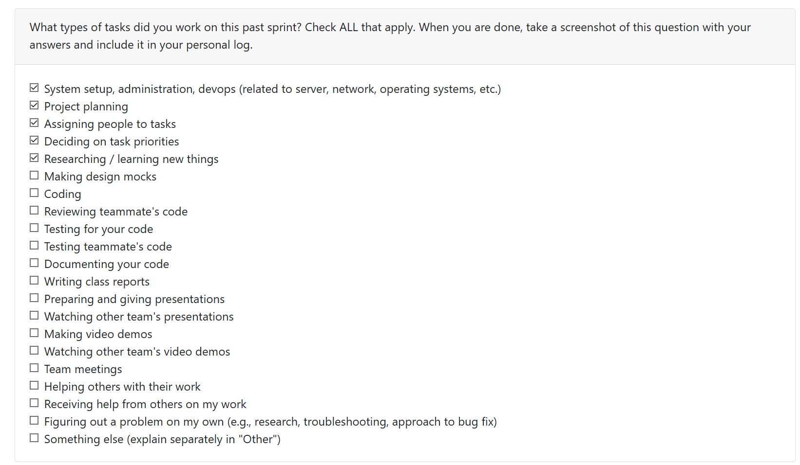

# Jacob Damery

## Week 17

This week, I focused on two major PRs: integrating config/profile APIs into the TUI and delivering resume items CRUD via the API.

### Key Accomplishments

- **Config + Profiles API Integration into TUI**  
  **PR #252**: https://github.com/COSC-499-W2025/capstone-project-team-7/pull/252  
  - Connected the TUI file browser search to the server-side `/api/projects/search` endpoint  
  - Added the API client method to centralize auth/base URL/error handling  
  - Restored the full file list when the search bar is cleared  
  - Updated API documentation to reflect the canonical files-only search endpoint  

- **Resume Items CRUD API Integration**  
  **PR #250**: https://github.com/COSC-499-W2025/capstone-project-team-7/pull/250  
  - Implemented resume items CRUD in the TUI routed through `/api/resume/items` when API mode is enabled  
  - Improved backend env loading and Supabase key lookup to avoid 503s in API mode  
  - Normalized project language data to prevent list validation errors  

- **Bug Fixes: API Stability & Resume/Config Flow**  
  **PR #254**: https://github.com/COSC-499-W2025/capstone-project-team-7/pull/254  
  - Fixed consent API crash on Python 3.9 by using `datetime.timezone.utc`  
  - Added missing service locks in `project_routes.py` to stop 500s on project endpoints  
  - Disabled resume encryption requirement by default to prevent 503s when `ENCRYPTION_MASTER_KEY` is absent  
  - Ensured config API flag is initialized before use in the TUI to prevent startup errors  

### Challenges & Learning

The main challenge was keeping API mode reliable while avoiding duplicated HTTP logic in the TUI, and then responding to the post‑PR runtime bugs that surfaced in local testing (missing service locks, Python 3.9 UTC incompatibility, and encryption key failures). Centralizing requests in API service classes improved consistency, and patching those backend issues stabilized the end‑to‑end flow.

### Impact

This work strengthens the API-driven TUI workflow, improves reliability in API mode, and ensures resume generation and file search behave consistently across sessions.

## Week 16

This week, I focused on solidifying the Skills Timeline + Portfolio Chronology APIs, tightening response typing, fixing Supabase integration test safety, and adding a TUI-based API validation flow to confirm the endpoints work end-to-end.

**Key Accomplishments:**

**Skills + Portfolio Chronology API Hardening (PR #233):** Implemented explicit response model construction for `/api/skills/timeline` and `/api/portfolio/chronology` to avoid implicit dict→model coercion and enforce strong typing. Ensured deterministic ordering is preserved while aligning responses with the documented schema.

**Supabase Integration Test Safety + Reliability:** Removed global mutation of `SUPABASE_KEY` in the integration test to avoid accidentally running the app with service-role privileges. Updated cleanup logic to use a service-role client directly while keeping app auth scoped. Added robust Supabase key fallback resolution in `ProjectsService` (`SUPABASE_KEY` → `SUPABASE_SERVICE_ROLE_KEY` → `SUPABASE_ANON_KEY`) so integration tests and local runs work without risky env overrides.

**TUI API Timeline Check for Validation:** Added a new TUI menu option "API Timeline Check" that performs live calls to `/api/skills/timeline` and `/api/portfolio/chronology` with the current session token and reports status codes + item counts. Added `.env` loading at TUI startup (repo root or CWD) for smoother local configuration. Verified it end‑to‑end against a running local FastAPI server.

**Challenges & Learning:**

The main friction was making integration tests safe without mutating global env state while still allowing test setup/cleanup to use elevated Supabase keys. I resolved this by isolating service-role access to the cleanup client and making the app rely on scoped env vars. I also learned that the TUI requires explicit `.env` loading and stable base URL configuration for reliable local API checks.

**Next Week Priorities:**

Next week, I'll expand the TUI validation flow to include lightweight response previews (first item summaries) and add automated tests for the new TUI API check behavior. I'll also formalize the local dev "run API + run TUI" workflow in documentation and verify timeline endpoints against larger datasets.

**Impact:**

This work locks down correctness for the new timeline endpoints, improves integration test safety, and adds a practical validation tool in the TUI so we can quickly confirm API health and user-scoped data. It reduces the risk of auth/scoping regressions and makes local verification faster for the team.

**Issues:**
[PR233](https://github.com/COSC-499-W2025/capstone-project-team-7/pull/233)

## Week 15

# Individual Weekly Report – Config & Profiles API (Ticket #202)

## Overview

This week focused on implementing the **Config and Profiles APIs** as outlined in **Ticket** [#202](https://github.com/orgs/COSC-499-W2025/projects/44/views/1?pane=issue&itemId=148050351&issue=COSC-499-W2025%7Ccapstone-project-team-7%7C202), with an emphasis on persistence, clean API design, and alignment with scan preferences across the system.  
The first couple of days were spent collaboratively reviewing the API plan as a team, clarifying requirements, and ensuring we had a shared understanding of how configuration and profiles should interact with existing components. During this planning phase, responsibilities were gradually distributed, and I took ownership of implementing the backend logic and tests related to config profiles.

I implemented the following endpoints, backed by the `ConfigManager`:

- `GET /api/config`
- `PUT /api/config`
- `GET /api/config/profiles`
- `POST /api/config/profiles`

The profiles API was designed to return and persist **single-object JSON responses** to avoid ambiguity and to align cleanly with frontend and downstream consumers. Profiles now persist correctly in Supabase and directly drive scan preferences, ensuring configuration changes are reflected consistently throughout the application.

To validate real-world behavior, I added an **environment-gated Supabase integration test** rather than relying on monkeypatching. This ensured that profile persistence and retrieval behave correctly against an actual Supabase instance. I also added unit-level tests to validate JSON response structure and response models, helping enforce API contract consistency. Tests were organized using a pytest `integration` marker to clearly separate local/unit tests from Supabase-backed integration tests.

---

## Reflection

### What went well
- Early API planning discussions helped prevent rework later in the week.
- Clear acceptance criteria made implementation straightforward.
- Supabase-backed integration testing provided strong confidence that persistence works as expected.
- Using response models to enforce single-object JSON output improved API reliability and consistency.

### What didn’t go well
- Some time was lost initially aligning test setup with environment-gated Supabase credentials.
- Debugging early integration test failures took longer than expected.

---

## Next Steps

- Continue implementing additional API routes from the API plan.
- Maintain the same pattern of clear response models, real persistence where appropriate, and accompanying tests.
- Further refine integration testing patterns to reduce setup friction for future contributors.

## Week 14 (Dec 1 – 7)
**Week 14: December 1 - December 7**

This week, I focused on restoring the Media Deep Dive in AI results and recording the weekly demo video. 

**Key Accomplishments:**
- **Media Deep Dive Fix:** Ensured media candidates are detected and forwarded to the LLM (`include_media=True`), so AI runs now surface Media Deep Dive with media briefings.
- **Demo Recording:** Recorded aspects of the demo video due this week.
**Challenges & Learning:** Needed to combine metadata, MIME, and extension checks to avoid missing media files in AI payloads; verified the UI wiring so the deep dive action appears reliably.

**Impact:** Media insights now show up in AI results, and the demo video documents the fix.
**Reflection**

What Went Well What Went Well was the recording of the project demo. Aswell, the bug fix for media deepdive was simple and quick to pushout 

This week was alot calmer as we have finished all the requirments for milestone #1 so everything this week went smoothly with nothing that went wrong for me on my side. 

**Issues:** [#184](https://github.com/COSC-499-W2025/capstone-project-team-7/pull/184)

## Week 13 (Nov 24 – 30)
This week I focused on two major areas of the project: external media analysis and refinements to the resume generation system.

External Media Analysis:
I expanded our analysis pipeline by implementing an external, LLM-powered media analysis workflow. This allows the system to process images, audio, and video using multimodal AI to extract higher-level semantic insights such as scene descriptions, object detection, and narrative summaries. I also worked on integrating these results cleanly into the existing TUI flow, ensuring the user can trigger and view media insights without breaking the local analysis experience.

Resume Generation Improvements:
I refined both the local and LLM-enhanced resume generation features to produce clearer, more consistent, and more professional output. This included improving how metadata and scan results feed into the generator, tightening the structure of bullet points, and reducing variability across projects. I also fixed several issues in how resume items were being saved and displayed, making the results more reliable and aligned with industry-standard phrasing.

### Reflection

**What Went Well** What Went Well
Multimodal external media analysis progressed significantly, and the integration with the TUI went smoother than expected. The LLM now consistently returns structured insights for images, audio, and video.
Resume generation quality improved noticeably after refining how scan metadata feeds into the generation pipeline. Outputs are more consistent, clearer, and closer to industry-ready bullet points.
The overall user workflow feels more polished, especially with more deterministic behavior between local and external analysis paths.
Fixed several smaller issues that improved reliability, including stability of resume saving and more predictable UI behavior.

**What Didn’t Go Well**
I got significantly stuck on adding video support to the media analysis pipeline. Handling video inputs required additional preprocessing steps (frame sampling, metadata extraction, and preparing the content for multimodal LLM ingestion), and I ran into multiple issues with formatting, file handling, and consistent output. This ended up taking more time than expected and slowed overall progress.
The multimodal media pipeline in general needed more debugging than anticipated, especially for larger or unusual media files that produced incomplete or unstable results.
Some resume generation outputs are still inconsistent across projects, meaning the formatting and tone require further refinement.

**Next up:** The next step is to review our Milestone 1 feedback and reassess our priorities for the upcoming milestone.

## Week 12 (Nov 16 – 23)

This week was split into two major pushes: first solidifying the resume-generation flow inside the CLI, and then extending it so generated resumes persist in Supabase with a full management UI.

Early in the week I focused on the local experience—polishing the resume-generation service, wiring it into the scan results dialog, capping bullet counts, formatting output, and ensuring users could instantly preview the Markdown. Once that workflow felt smooth, I shifted to persistence. I added the `resume_items` table and migration, built a `ResumeStorageService`, and wired up Supabase so every generated resume stores metadata, markdown content, and timestamps. The Textual UI gained a new **“View Saved Resumes”** modal with keyboard shortcuts, metadata preview, and delete support (which removes the row from Supabase). I also updated documentation (`README` + `systemArchitecture`) and added a dedicated test file (`tests/cli/test_resume_storage_service.py`) to cover the new service.

### Reflection

**What went well:**  
Building the flow locally first helped validate the UX before introducing Supabase, and the storage integration fit cleanly thanks to the new service layer and RLS token handling. Textual made the modal straightforward, and the dedicated test suite increased confidence in the changes.

**What didn’t go well:**  
Getting the modal footer to render consistently required several CSS adjustments, and review-driven conflicts led to a longer rebase than expected.

**Next up:** Start exploring **Issue #49 – “Retrieve previously generated portfolio information.”** That will likely build on the existing Supabase sync/design pattern to pull past scan artifacts back into the CLI UI

## Week 10 (November 3rd – 9th)

I expanded our local media analyzer so every modality—images, video frames, and now audio—produces meaningful insights entirely offline. A new PyTorch helper loads TorchVision’s ResNet for visual labels and Torchaudio + Librosa for wav2vec2 transcription, BPM estimation, spectral centroid, and heuristic genre tags. Those labels, summaries, tempo stats, and transcript excerpts now flow through the scanner, MediaAnalyzer, CLI tables, and JSON output, giving reviewers immediate context without calling external APIs.

### Reflection

- **What went well:** The PyTorch/Torchaudio modules plugged into the existing scanner pipeline with minimal refactors, analyzer metrics automatically picked up the new fields, and the CLI felt more useful once tempo/genre summaries appeared next to each clip.
- **What didn’t go well:** Librosa’s extra dependencies slowed down the first install, torchaudio emitted deprecation warnings during MP3 loads, and full `pytest` runs still choke on Supabase config because the upstream tests require real credentials.

### Next Steps

1. Add a cache/weights preloader so the first CLI run doesn’t stall while wav2vec2 downloads.  
2. Offer a “lightweight” mode that skips transcription when users only need tempo/genre.  
3. Update repository tests to mock Supabase so the full suite can run headless.

## Week 9 October 27th - November 2nd
This week I worked on the full media analysis flow: the scanner now extracts structured metadata for images, audio, and video; a deterministic MediaAnalyzer rolls it into insights/issues (with tests and docs); and a Rich/Questionary CLI lets teammates explore results interactively. I experimented with a CLIP/Whisper “advanced” layer but parked it because the dependency stack was heavy. Most friction came from polishing the CLI (handling non-TTY prompts, default paths, exit behavior) and keeping everything Python 3.9-compatible

## Week 8: October 19 - October 26

*This week, I worked on integrating Supabase into our Portfolio Manager backend. I set up the environment with the project URL and anon key, and began building out the database schema and storage policies. I also started creating an upload test to verify file and metadata storage, but ran into bugs that prevented it from running successfully. I wasn’t able to finish the work or open a PR this week, but made progress on the Supabase integration that I’ll continue next week.*

## Week 7: October 12 - October 19

*This week, I worked on implementing the consent management module which provides the logic for handling user permissions when interacting with external services such as LLMs. This module involved creating functions that allow the system to request consent, save the user’s decision, check if consent has been given, and allow consent to be withdrawn. The module also integrates a detailed privacy notice so that users are informed about data transmission and storage risks before giving permission. I then implemented a set of unit tests (5 in total) that verify both the positive and negative paths (agree/decline), default behavior when no record exists, and the withdrawal process. Finally, I resolved rebase conflicts with main to ensure the consent module and tests were properly integrated into the backend, and I prepared a structured PR documenting these changes.*

## Week 6: October 6th - 12th

This week, I put my efforts into establishing the file hierarchy within the development environment we are working on. The creation of the first folders and files required for the project took place along with the addition of inline documentation to each file. The documentation covers the file's purpose, the functionality aimed at, and any future implementations that might need to be added are written as comments. Team collaboration will be simpler with this structure, as it will be clear for everybody through the documentation where each part is going to be placed while the system is still being built.

## Week 5: September 29 - October 5

I was absent on Monday but joined the team on Wednesday when we were finalizing our Data Flow Diagrams (Levels 0 and 1). During that session, I helped review the process connections and verified that all data stores, inputs, and outputs were correctly linked. I also contributed to checking for any missing internal processes and ensuring that the diagrams accurately reflected the system’s workflow*

## Week 4: September 22 - 28

*This week, I examined integration and compatibility options for several third-party APIs and backend systems. I analyzed the potential impact of various authentication models, data structures, and rate-limiting behaviors on our architecture, identifying integration risks and outlining strategies for risk mitigation. At the same time, I made considerable progress on expanding the use-case section of our project proposal.*

# Week 3: September 15 - 21
This week I explored possible tools and backend libraries that could support our app, comparing their features and suitability.

