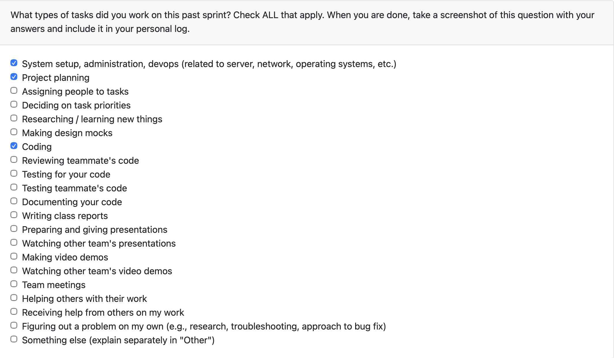
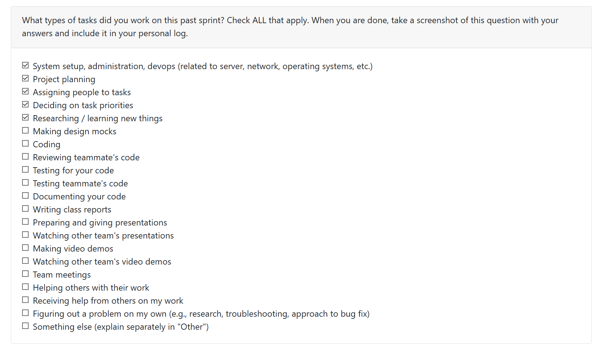

# Jacob Damery

# Week 24: March 9 – March 15

This week I focused on portfolio UI improvements and bug fixes while also reviewing several teammate PRs spanning project ranking, public portfolio sharing, skills backend enrichment, session invalidation, and reusable component extraction. My authored work included a full redesign of the portfolio page and a targeted bug fix for the project detail page.

## Key Accomplishments

### Portfolio Page UI Redesign [PR #424](https://github.com/COSC-499-W2025/capstone-project-team-7/pull/424)

I redesigned the portfolio page UI with improved component styling, better data handling, and enhanced interactivity across multiple sections.

Key work included:

- Rebuilt the activity heatmap to display commit counts inside cells, show yearly totals, and use a sky-blue color scheme.
- Updated the skills timeline to sort newest-first with a card-based layout grouped by period.
- Added a publish/unpublish toggle and a copy share link button to the portfolio overview.
- Updated `portfolio.test.tsx` to navigate to the Portfolio Items tab before asserting on item content, matching the new tabbed UI.
- Enriched mock data with `contribution_score`, `total_commits`, `user_commit_share`, and skills timeline entries to cover the new overview sections.
- Manually tested publish/unpublish toggle, copy share link, heatmap rendering, and skills timeline sorting.

### Evidence Retrieval Bug Fix [PR #418](https://github.com/COSC-499-W2025/capstone-project-team-7/pull/418)

I fixed a crash in the ProjectPage component caused by a type mismatch in the evidence retrieval method.

Key work included:

- Identified that `getSkillEvidence` in `project/page.tsx` was calling `.get()` on the return value of `buildEvidenceMap`, treating it as a `Map` when it actually returns a plain `Record<string, string[]>` object. This caused an uncaught `TypeError: evidenceMap.get is not a function` on every render.
- Updated `buildEvidenceMap` in `lib/skills-utils.ts` to return `Record<string, SkillEvidenceItem[]>`, preserving evidence as structured objects rather than flattened strings.
- Changed `evidenceMap.get(skillName)` to `evidenceMap[skillName]` in the project page for correct plain-object bracket access.

## Code Reviews

### Project Rankings by User Contribution [PR #423](https://github.com/COSC-499-W2025/capstone-project-team-7/pull/423)
Reviewed Samarth's PR that replaces manual project reordering with a persisted ranking preference (contribution or recency) on the Projects page, including a database migration adding `user_selections.sort_mode` and updated backend/frontend tests. Approved the PR.

### Portfolio Public Mode [PR #421](https://github.com/COSC-499-W2025/capstone-project-team-7/pull/421)
Reviewed OM's PR adding public portfolio sharing via a shareable `/p?token=xxx` link with no authentication required, along with auto-ranking of projects by contribution score after scan completion. A large PR spanning 34 files and 26 commits.

### Skills Backend Enrichment [PR #398](https://github.com/COSC-499-W2025/capstone-project-team-7/pull/398)
Reviewed OM's bug fix addressing a non-existent `skill.confidence` attribute (corrected to `skill.proficiency_score`), enriched skills API payloads, tightened regex patterns to reduce false positives, and added commit message scanning for CI/CD and testing practices. All 39 tests passing.

### Session Invalidation on Logout [PR #399](https://github.com/COSC-499-W2025/capstone-project-team-7/pull/399)
Reviewed Joaquin's fix for logout session recovery by invalidating Supabase refresh tokens server-side and blocking frontend refresh after explicit logout. Included new backend auth route, logout-flag checks, and focused backend/frontend tests.

### Reusable Project Components [PR #417](https://github.com/COSC-499-W2025/capstone-project-team-7/pull/417)
Reviewed Vlad's large refactor extracting reusable UI components from a monolithic 2425-line project page file into dedicated components and shared primitives (StatCard, LoadingState, ErrorState, EmptyState, SearchInput), cutting the file nearly in half while preserving identical behavior. 23 files changed across 16 commits.

## Challenges & Learning

The portfolio UI redesign required coordinating changes across the heatmap, skills timeline, and overview sections simultaneously while keeping existing tests passing. Updating the test suite to account for the new tabbed layout was important since assertions that previously worked against a flat page structure needed to first navigate to the correct tab.

The evidence retrieval bug was a good example of how TypeScript type mismatches can hide behind working code until runtime — the `buildEvidenceMap` function's return type didn't match how it was being consumed, and the error only surfaced as a crash on render.

## Impact

This week's work improves the portfolio page's usability and visual quality while fixing a runtime crash that affected the project detail page. Code reviews across five PRs helped maintain quality and consistency as the team integrates major features including public portfolio sharing, project ranking, session security, and component architecture improvements heading into the final stretch.


---

# Week 23: March 2 – March 8

This week I focused on improving system reliability and developer visibility through expanded test coverage and environment validation tooling. My primary contributions included adding a comprehensive automated test suite for the project filtering system and implementing an encryption status feature that verifies backend encryption configuration and exposes it through the API and Settings UI.

## Key Accomplishments

### Advanced Filtering Test Suite [PR 388](https://github.com/COSC-499-W2025/capstone-project-team-7/pull/388)

I implemented a full automated test suite for the `SearchFilterTab` component, which previously had no test coverage. This component performs client-side filtering of project files within the tools panel.

Key work included:

- Created `search-filter-tab.test.tsx` with 35 tests across 9 describe blocks.
- Tested loading, error, empty, and normal render states.
- Verified debounced search behavior, case-insensitive matching, and filter combinations.
- Tested language, file type, and directory filters along with sortable file listings.
- Ensured correct rendering of file metadata such as file names, extension badges, paths, and file sizes.

These tests ensure the filtering system behaves reliably and help prevent regressions as the component evolves.

### Encryption Status Monitoring [PR 389](https://github.com/COSC-499-W2025/capstone-project-team-7/pull/389)

I implemented an encryption status reporting feature across the backend and frontend Settings page.

Key work included:

- Added backend endpoint:
```
  GET /api/encryption/status
```

  which reports whether encryption is enabled, ready, or misconfigured.
- Implemented UI indicators in Settings showing encryption readiness and configuration errors.
- Added guidance for encryption setup.
- Fixed `.env` loading so `ENCRYPTION_MASTER_KEY` is correctly detected when launching through Electron.
- Added backend and frontend tests for encryption status handling.

This feature improves transparency by surfacing encryption configuration issues early rather than allowing them to fail silently.

## Challenges & Learning

One challenge involved ensuring environment variables loaded correctly when the application was launched through Electron rather than directly in development. This required tracing how `.env` variables were initialized and ensuring `python-dotenv` executed early enough during application startup.

Writing tests for the filtering system also highlighted the complexity of client-side UI logic when multiple filters and debounce behavior interact, reinforcing the importance of structured testing.

## Impact

This week's work improves both application stability and developer confidence. The encryption status feature prevents hidden configuration failures, while the new filtering test suite strengthens frontend reliability and reduces the risk of regressions in the project tools interface.


# Week 22: February 23 – March 1

This week, I focused on implementing a fully functional Portfolio page within the Electron application and resolving a blocking backend bug in the AI generation endpoint. My primary contribution was delivering the Portfolio feature (merged PR), while also addressing code review feedback to improve consistency and robustness across the API layer.

---

## Key Accomplishments

### Portfolio Page Implementation [PR 366](https://github.com/COSC-499-W2025/capstone-project-team-7/pull/366)

I implemented the Portfolio page at `/portfolio`, resolving a broken sidebar link that previously resulted in a 404. The page provides a complete portfolio management experience within the existing Electron dashboard.

**Core Work:**

- Built full CRUD interface for portfolio items (create, edit, delete, list) using a Dialog-based form with controlled state.
- Implemented a collapsible Skills Summary section, surfacing aggregated skill badges from `GET /api/skills`.
- Built a Project Timeline tab rendering chronological project data from `GET /api/portfolio/chronology`, including date ranges, roles, and per-project evidence bullets.
- Implemented an AI-assisted "Generate from Project" feature using `POST /api/portfolio/generate`, allowing users to pre-fill the form from an existing scanned project.
- Used `Promise.allSettled` for parallel data fetching with graceful degradation — skills and timeline failures surface as warnings without blocking the items list.
- Added thumbnail rendering to portfolio item cards, with silent error fallback if the URL is broken.
- Fixed dialog overflow on small Electron windows by constraining the modal to `max-h-[90vh]` with an independently scrollable form body.
- Wrote **40 unit and integration tests** covering loading states, CRUD flows, error banners, skills section toggle, generate from project, timeline tab, and auth token injection.

This feature resolves the last unimplemented sidebar route and brings the Portfolio section to functional parity with the Projects and Resumes pages.

---

### Backend Bug Fix — `POST /api/portfolio/generate` 500 Error

Diagnosed and fixed a crash in the AI generation endpoint affecting any project where `scan_data` was stored as `None` in the database (unscanned projects, decryption failures, or explicit null DB values).

**Root cause:** `project.get("scan_data", {})` returns `None` when the key exists with a `None` value — the default is only applied when the key is absent. All subsequent `.get()` calls on the `None` value threw `AttributeError`, caught by a bare `except Exception` and returned as a 500.

**Fix:**

```python
_raw = project.get("scan_data")
scan_data = _raw if isinstance(_raw, dict) else {}
```

This makes the generate endpoint safe for all project states, not just fully scanned ones.

---

### Code Review Feedback — API Layer Hardening

Following a PR review, I addressed several consistency issues across the API client layer:

- Aligned `NEXT_PUBLIC_API_URL` → `NEXT_PUBLIC_API_BASE_URL` in `lib/api/portfolio.ts` and `lib/api/projects.ts` to match the canonical `lib/api.ts` — prevents silent failures in non-localhost deployments.
- Added `.catch(() => ({}))` to all `response.json()` error-path calls in `projects.ts` (11 handlers) to match the pattern already established in `portfolio.ts`.
- Wired the unused `category` query parameter on `getSkills()` so callers can filter by skill category as the backend already supports.
- Added `maxLength` attributes to all portfolio form inputs matching backend validation constraints (`title: 255`, `role: 255`, `summary: 1000`, `evidence: 2048`, `thumbnail: 1024`).
- Added per-item delete loading state (`deletingId`) to prevent duplicate delete requests from double-clicks, with visual "Deleting…" feedback on the button.

---

## Challenges & Learning

A key challenge was diagnosing the `scan_data` crash — the error was swallowed by a broad `except Exception` block and returned generically as a 500, making it appear to be an AI/LLM failure rather than a data access bug. This reinforced the value of:

- Defensive null handling at data access boundaries, not just at API input validation
- Reading full stack traces rather than trusting surface-level HTTP status codes
- Verifying fixes on disk after every edit in a hot-reload environment

Handling the detail object format from portfolio endpoints (`{"code": "...", "message": "..."}`) also highlighted the importance of consistent error response shapes across backend routes — inconsistent formats silently degrade to `[object Object]` in the UI without any obvious breakage during development.

---

## Next Week Priorities

- Investigate and resolve remaining frontend TypeScript type duplication (`ProjectMetadata` across `types/project.ts` and `lib/api.types.ts`).
- Expand backend test coverage to portfolio CRUD, generate, and chronology endpoints.
- Consolidate API client error handling and token refresh logic into a shared base layer.
- Continue reviewing and integrating teammate PRs to maintain UI consistency.

---

## Impact

This week's work closes the last unimplemented navigation route in the application and delivers a production-ready portfolio management interface backed by real AI-assisted generation. The backend bug fix makes the generate endpoint reliable for all users regardless of their project scan state, resolving a class of 500 errors that would have affected any user attempting to use the feature on unscanned or partially scanned projects.

Addressing the PR review feedback improved consistency and resilience across the entire API client layer — changes that benefit all pages consuming `lib/api/projects.ts`, not just the portfolio feature.


## Week 20 
This week, I focused on implementing a fully functional Language Breakdown feature within the Project Detail page and ensuring data accuracy across the project view. My primary contribution was delivering the Language Breakdown tab (PR #328), while also reviewing and validating related fixes from teammates to maintain UI consistency and data integrity across the application.

---

## Key Accomplishments

### Language Breakdown Tab Implementation [PR #328](https://github.com/COSC-499-W2025/capstone-project-team-7/pull/328)

I implemented a new **Language Breakdown** tab on the Project Detail page powered directly by scan payload language statistics.

**Core Work:**
- Built a normalization helper to handle multiple possible payload shapes for language stats.
- Rendered a lightweight stacked bar visualization to communicate distribution clearly.
- Added a corresponding table view for precise numeric representation.
- Implemented loading, empty, and error states consistent with the rest of the application.
- Wrote unit tests for the `normalizeLanguageStats` helper to ensure resilience and maintainability.
- Maintained zero new dependencies to avoid increasing project complexity.

This feature improves transparency into scanned project composition and strengthens the analytical depth of the application.

---

### Code Reviews & Integration Support

In addition to feature development, I reviewed the following merged pull requests to ensure architectural and UI consistency:

#### [PR #324](https://github.com/COSC-499-W2025/capstone-project-team-7/pull/323) – Login Bug in Settings Page

Reviewed authentication logout flow fixes to confirm:
- All authentication tokens are properly cleared from `localStorage`.
- Logout behavior is consistent across hooks and the settings page.
- Redirect logic is immediate and secure.
- E2E and backend tests prevent regression.

This was a critical stability fix affecting security and session integrity.

---

#### [PR #323](https://github.com/COSC-499-W2025/capstone-project-team-7/pull/323) – Project Page Data Accuracy & Empty-State Handling

Reviewed updates that:
- Removed misleading hardcoded/fallback project metadata.
- Ensured scan duration and metadata are API-backed.
- Improved empty-state clarity when no project is loaded.
- Preserved existing loading and error state behavior.

I specifically validated that these changes aligned with the new Language Breakdown tab and did not introduce inconsistent state behavior across tabs.

---

## Challenges & Learning

A key challenge was designing normalization logic that safely supports evolving scan payload formats. Since scan data can differ depending on AI or local processing pipelines, the transformation layer needed to defensively handle:

- Undefined or missing values  
- Unexpected payload shapes  
- Incomplete language statistics  

This reinforced the importance of:

- Separating transformation logic from presentation logic  
- Writing focused unit tests for data utilities  
- Designing loading/empty/error states as first-class UI states  

Reviewing authentication-related changes also strengthened my understanding of token lifecycle management and the risks of inconsistent storage keys across hooks.

---

## Next Week Priorities

- Expand analytical views with additional scan-backed breakdown metrics.
- Continue aligning UI state handling patterns across all tabs.
- Improve visualization polish (percentage formatting, spacing, responsiveness).
- Assist with resolving existing frontend type issues blocking full build success.

---

## Impact

This week’s work strengthens the analytical credibility of the Portfolio Manager by surfacing real scan-backed language metrics in a structured, tested format. The addition of normalization logic and unit tests improves long-term maintainability and reduces risk as backend payloads evolve.

By contributing a new feature and reviewing critical stability fixes, I supported both feature depth and system reliability within the Electron application.

## Week 18 - 19

This week, I focused on laying the groundwork for a more complete and cohesive user interface in the Electron application. My work centered on establishing global styling conventions and implementing a modern sidebar-based navigation layout. This marked an important step toward transitioning the project from isolated components into a unified, full-featured UI.

**Key Accomplishments:**

**Global Styling & Visual System (PR #XXX):** Implemented a refactored global CSS structure to define consistent colors, typography, and layout behavior across the application. Established a high-contrast, clarity-first visual style to improve readability and reduce visual noise. Standardized base styles for common UI elements to minimize per-component overrides moving forward.
[PR #260](https://github.com/COSC-499-W2025/capstone-project-team-7/pull/260)

**Sidebar & Application Layout:** Designed and implemented a fixed sidebar navigation system suitable for a desktop Electron environment. Introduced a new application layout wrapper to manage the relationship between the sidebar and main content area. Structured navigation to support current and upcoming application sections in a scalable way. Integrated routing to ensure smooth navigation between views within the new layout.
[PR #264](https://github.com/COSC-499-W2025/capstone-project-team-7/pull/264)

Feature / UI Integration: Implemented the Media Analysis tab within the Project Analysis section, establishing a clear, AI-first insights pipeline. The UI prioritizes AI-generated media insights from scan_data.llm_media, with a robust fallback to local scan_data.media_analysis when AI results are unavailable. This ensures consistent insight delivery across different project states. 
[PR 292](https://github.com/COSC-499-W2025/capstone-project-team-7/pull/292)


**Challenges & Learning:**

The main friction was encountering a tricky merge conflict in `package-lock.json` that took extra time to diagnose and resolve. Resolving dependency-related conflicts highlighted the need for more caution when rebasing or merging branches that modify lockfiles. I also learned through code review that initial implementation of typography and destructive colors required refinement to avoid component conflicts and improve UX.

**Next Week Priorities:**

Next week, I'll continue expanding the UI using the new layout and styling foundations. I'll refine navigation behavior and visual polish across additional views, apply the global styling system to remaining components for consistency, and update existing components to use the new `.pc-typography` wrapper where appropriate. I'll also test destructive button styles across different use cases to ensure consistent behavior.

**Impact:**

This work establishes a solid foundation for building out the full desktop UI experience. Taking time to align with the team on UI structure and design decisions led to strong consensus and fewer reworks. The foundational layout and styling system creates a clearer path for future feature development and ensures visual consistency across the application.


## Week 17

This week, I focused on two major PRs: integrating config/profile APIs into the TUI and delivering resume items CRUD via the API.

### Key Accomplishments

- **Config + Profiles API Integration into TUI**  
  **PR #252**: https://github.com/COSC-499-W2025/capstone-project-team-7/pull/252  
  - Connected the TUI file browser search to the server-side `/api/projects/search` endpoint  
  - Added the API client method to centralize auth/base URL/error handling  
  - Restored the full file list when the search bar is cleared  
  - Updated API documentation to reflect the canonical files-only search endpoint  

- **Resume Items CRUD API Integration**  
  **PR #250**: https://github.com/COSC-499-W2025/capstone-project-team-7/pull/250  
  - Implemented resume items CRUD in the TUI routed through `/api/resume/items` when API mode is enabled  
  - Improved backend env loading and Supabase key lookup to avoid 503s in API mode  
  - Normalized project language data to prevent list validation errors  

- **Bug Fixes: API Stability & Resume/Config Flow**  
  **PR #254**: https://github.com/COSC-499-W2025/capstone-project-team-7/pull/254  
  - Added missing service locks in `project_routes.py` to stop 500s on project endpoints  
  - Disabled resume encryption requirement by default to prevent 503s when `ENCRYPTION_MASTER_KEY` is absent  
  - Ensured config API flag is initialized before use in the TUI to prevent startup errors  

### Challenges & Learning

The main challenge was keeping API mode reliable while avoiding duplicated HTTP logic in the TUI, and then responding to the post‑PR runtime bugs that surfaced in local testing (missing service locks, Python 3.9 UTC incompatibility, and encryption key failures). Centralizing requests in API service classes improved consistency, and patching those backend issues stabilized the end‑to‑end flow.


### Impact

This work strengthens the API-driven TUI workflow, improves reliability in API mode, and ensures resume generation and file search behave consistently across sessions.


## Week 16

This week, I focused on solidifying the Skills Timeline + Portfolio Chronology APIs, tightening response typing, fixing Supabase integration test safety, and adding a TUI-based API validation flow to confirm the endpoints work end-to-end.

**Key Accomplishments:**

**Skills + Portfolio Chronology API Hardening (PR #233):** Implemented explicit response model construction for `/api/skills/timeline` and `/api/portfolio/chronology` to avoid implicit dict→model coercion and enforce strong typing. Ensured deterministic ordering is preserved while aligning responses with the documented schema.

**Supabase Integration Test Safety + Reliability:** Removed global mutation of `SUPABASE_KEY` in the integration test to avoid accidentally running the app with service-role privileges. Updated cleanup logic to use a service-role client directly while keeping app auth scoped. Added robust Supabase key fallback resolution in `ProjectsService` (`SUPABASE_KEY` → `SUPABASE_SERVICE_ROLE_KEY` → `SUPABASE_ANON_KEY`) so integration tests and local runs work without risky env overrides.

**TUI API Timeline Check for Validation:** Added a new TUI menu option "API Timeline Check" that performs live calls to `/api/skills/timeline` and `/api/portfolio/chronology` with the current session token and reports status codes + item counts. Added `.env` loading at TUI startup (repo root or CWD) for smoother local configuration. Verified it end‑to‑end against a running local FastAPI server.

**Challenges & Learning:**

The main friction was making integration tests safe without mutating global env state while still allowing test setup/cleanup to use elevated Supabase keys. I resolved this by isolating service-role access to the cleanup client and making the app rely on scoped env vars. I also learned that the TUI requires explicit `.env` loading and stable base URL configuration for reliable local API checks.

**Next Week Priorities:**

Next week, I'll expand the TUI validation flow to include lightweight response previews (first item summaries) and add automated tests for the new TUI API check behavior. I'll also formalize the local dev "run API + run TUI" workflow in documentation and verify timeline endpoints against larger datasets.

**Impact:**

This work locks down correctness for the new timeline endpoints, improves integration test safety, and adds a practical validation tool in the TUI so we can quickly confirm API health and user-scoped data. It reduces the risk of auth/scoping regressions and makes local verification faster for the team.


**Issues:**
[PR233](https://github.com/COSC-499-W2025/capstone-project-team-7/pull/233)


## Week 15

# Individual Weekly Report – Config & Profiles API (Ticket #202)

## Overview

This week focused on implementing the **Config and Profiles APIs** as outlined in **Ticket** [#202](https://github.com/orgs/COSC-499-W2025/projects/44/views/1?pane=issue&itemId=148050351&issue=COSC-499-W2025%7Ccapstone-project-team-7%7C202), with an emphasis on persistence, clean API design, and alignment with scan preferences across the system.  
The first couple of days were spent collaboratively reviewing the API plan as a team, clarifying requirements, and ensuring we had a shared understanding of how configuration and profiles should interact with existing components. During this planning phase, responsibilities were gradually distributed, and I took ownership of implementing the backend logic and tests related to config profiles.

I implemented the following endpoints, backed by the `ConfigManager`:

- `GET /api/config`
- `PUT /api/config`
- `GET /api/config/profiles`
- `POST /api/config/profiles`

The profiles API was designed to return and persist **single-object JSON responses** to avoid ambiguity and to align cleanly with frontend and downstream consumers. Profiles now persist correctly in Supabase and directly drive scan preferences, ensuring configuration changes are reflected consistently throughout the application.

To validate real-world behavior, I added an **environment-gated Supabase integration test** rather than relying on monkeypatching. This ensured that profile persistence and retrieval behave correctly against an actual Supabase instance. I also added unit-level tests to validate JSON response structure and response models, helping enforce API contract consistency. Tests were organized using a pytest `integration` marker to clearly separate local/unit tests from Supabase-backed integration tests.

---

## Reflection

### What went well
- Early API planning discussions helped prevent rework later in the week.
- Clear acceptance criteria made implementation straightforward.
- Supabase-backed integration testing provided strong confidence that persistence works as expected.
- Using response models to enforce single-object JSON output improved API reliability and consistency.

### What didn’t go well
- Some time was lost initially aligning test setup with environment-gated Supabase credentials.
- Debugging early integration test failures took longer than expected.

---

## Next Steps

- Continue implementing additional API routes from the API plan.
- Maintain the same pattern of clear response models, real persistence where appropriate, and accompanying tests.
- Further refine integration testing patterns to reduce setup friction for future contributors.


## Week 14 (Dec 1 – 7)
**Week 14: December 1 - December 7**

This week, I focused on restoring the Media Deep Dive in AI results and recording the weekly demo video. 

**Key Accomplishments:**
- **Media Deep Dive Fix:** Ensured media candidates are detected and forwarded to the LLM (`include_media=True`), so AI runs now surface Media Deep Dive with media briefings.
- **Demo Recording:** Recorded aspects of the demo video due this week.
**Challenges & Learning:** Needed to combine metadata, MIME, and extension checks to avoid missing media files in AI payloads; verified the UI wiring so the deep dive action appears reliably.

**Impact:** Media insights now show up in AI results, and the demo video documents the fix.
**Reflection**

What Went Well What Went Well was the recording of the project demo. Aswell, the bug fix for media deepdive was simple and quick to pushout 


This week was alot calmer as we have finished all the requirments for milestone #1 so everything this week went smoothly with nothing that went wrong for me on my side. 

**Issues:** [#184](https://github.com/COSC-499-W2025/capstone-project-team-7/pull/184)


## Week 13 (Nov 24 – 30)
This week I focused on two major areas of the project: external media analysis and refinements to the resume generation system.

External Media Analysis:
I expanded our analysis pipeline by implementing an external, LLM-powered media analysis workflow. This allows the system to process images, audio, and video using multimodal AI to extract higher-level semantic insights such as scene descriptions, object detection, and narrative summaries. I also worked on integrating these results cleanly into the existing TUI flow, ensuring the user can trigger and view media insights without breaking the local analysis experience.

Resume Generation Improvements:
I refined both the local and LLM-enhanced resume generation features to produce clearer, more consistent, and more professional output. This included improving how metadata and scan results feed into the generator, tightening the structure of bullet points, and reducing variability across projects. I also fixed several issues in how resume items were being saved and displayed, making the results more reliable and aligned with industry-standard phrasing.

### Reflection

**What Went Well** What Went Well
Multimodal external media analysis progressed significantly, and the integration with the TUI went smoother than expected. The LLM now consistently returns structured insights for images, audio, and video.
Resume generation quality improved noticeably after refining how scan metadata feeds into the generation pipeline. Outputs are more consistent, clearer, and closer to industry-ready bullet points.
The overall user workflow feels more polished, especially with more deterministic behavior between local and external analysis paths.
Fixed several smaller issues that improved reliability, including stability of resume saving and more predictable UI behavior.

**What Didn’t Go Well**
I got significantly stuck on adding video support to the media analysis pipeline. Handling video inputs required additional preprocessing steps (frame sampling, metadata extraction, and preparing the content for multimodal LLM ingestion), and I ran into multiple issues with formatting, file handling, and consistent output. This ended up taking more time than expected and slowed overall progress.
The multimodal media pipeline in general needed more debugging than anticipated, especially for larger or unusual media files that produced incomplete or unstable results.
Some resume generation outputs are still inconsistent across projects, meaning the formatting and tone require further refinement.

**Next up:** The next step is to review our Milestone 1 feedback and reassess our priorities for the upcoming milestone.


## Week 12 (Nov 16 – 23)

This week was split into two major pushes: first solidifying the resume-generation flow inside the CLI, and then extending it so generated resumes persist in Supabase with a full management UI.

Early in the week I focused on the local experience—polishing the resume-generation service, wiring it into the scan results dialog, capping bullet counts, formatting output, and ensuring users could instantly preview the Markdown. Once that workflow felt smooth, I shifted to persistence. I added the `resume_items` table and migration, built a `ResumeStorageService`, and wired up Supabase so every generated resume stores metadata, markdown content, and timestamps. The Textual UI gained a new **“View Saved Resumes”** modal with keyboard shortcuts, metadata preview, and delete support (which removes the row from Supabase). I also updated documentation (`README` + `systemArchitecture`) and added a dedicated test file (`tests/cli/test_resume_storage_service.py`) to cover the new service.

### Reflection

**What went well:**  
Building the flow locally first helped validate the UX before introducing Supabase, and the storage integration fit cleanly thanks to the new service layer and RLS token handling. Textual made the modal straightforward, and the dedicated test suite increased confidence in the changes.

**What didn’t go well:**  
Getting the modal footer to render consistently required several CSS adjustments, and review-driven conflicts led to a longer rebase than expected.


**Next up:** Start exploring **Issue #49 – “Retrieve previously generated portfolio information.”** That will likely build on the existing Supabase sync/design pattern to pull past scan artifacts back into the CLI UI


## Week 10 (November 3rd – 9th)

I expanded our local media analyzer so every modality—images, video frames, and now audio—produces meaningful insights entirely offline. A new PyTorch helper loads TorchVision’s ResNet for visual labels and Torchaudio + Librosa for wav2vec2 transcription, BPM estimation, spectral centroid, and heuristic genre tags. Those labels, summaries, tempo stats, and transcript excerpts now flow through the scanner, MediaAnalyzer, CLI tables, and JSON output, giving reviewers immediate context without calling external APIs.

### Reflection

- **What went well:** The PyTorch/Torchaudio modules plugged into the existing scanner pipeline with minimal refactors, analyzer metrics automatically picked up the new fields, and the CLI felt more useful once tempo/genre summaries appeared next to each clip.
- **What didn’t go well:** Librosa’s extra dependencies slowed down the first install, torchaudio emitted deprecation warnings during MP3 loads, and full `pytest` runs still choke on Supabase config because the upstream tests require real credentials.

### Next Steps

1. Add a cache/weights preloader so the first CLI run doesn’t stall while wav2vec2 downloads.  
2. Offer a “lightweight” mode that skips transcription when users only need tempo/genre.  
3. Update repository tests to mock Supabase so the full suite can run headless.


## Week 9 October 27th - November 2nd
This week I worked on the full media analysis flow: the scanner now extracts structured metadata for images, audio, and video; a deterministic MediaAnalyzer rolls it into insights/issues (with tests and docs); and a Rich/Questionary CLI lets teammates explore results interactively. I experimented with a CLIP/Whisper “advanced” layer but parked it because the dependency stack was heavy. Most friction came from polishing the CLI (handling non-TTY prompts, default paths, exit behavior) and keeping everything Python 3.9-compatible


## Week 8: October 19 - October 26

*This week, I worked on integrating Supabase into our Portfolio Manager backend. I set up the environment with the project URL and anon key, and began building out the database schema and storage policies. I also started creating an upload test to verify file and metadata storage, but ran into bugs that prevented it from running successfully. I wasn’t able to finish the work or open a PR this week, but made progress on the Supabase integration that I’ll continue next week.*


## Week 7: October 12 - October 19

*This week, I worked on implementing the consent management module which provides the logic for handling user permissions when interacting with external services such as LLMs. This module involved creating functions that allow the system to request consent, save the user’s decision, check if consent has been given, and allow consent to be withdrawn. The module also integrates a detailed privacy notice so that users are informed about data transmission and storage risks before giving permission. I then implemented a set of unit tests (5 in total) that verify both the positive and negative paths (agree/decline), default behavior when no record exists, and the withdrawal process. Finally, I resolved rebase conflicts with main to ensure the consent module and tests were properly integrated into the backend, and I prepared a structured PR documenting these changes.*


## Week 6: October 6th - 12th

This week, I put my efforts into establishing the file hierarchy within the development environment we are working on. The creation of the first folders and files required for the project took place along with the addition of inline documentation to each file. The documentation covers the file's purpose, the functionality aimed at, and any future implementations that might need to be added are written as comments. Team collaboration will be simpler with this structure, as it will be clear for everybody through the documentation where each part is going to be placed while the system is still being built.



## Week 5: September 29 - October 5

I was absent on Monday but joined the team on Wednesday when we were finalizing our Data Flow Diagrams (Levels 0 and 1). During that session, I helped review the process connections and verified that all data stores, inputs, and outputs were correctly linked. I also contributed to checking for any missing internal processes and ensuring that the diagrams accurately reflected the system’s workflow*



## Week 4: September 22 - 28

*This week, I examined integration and compatibility options for several third-party APIs and backend systems. I analyzed the potential impact of various authentication models, data structures, and rate-limiting behaviors on our architecture, identifying integration risks and outlining strategies for risk mitigation. At the same time, I made considerable progress on expanding the use-case section of our project proposal.*


# Week 3: September 15 - 21
This week I explored possible tools and backend libraries that could support our app, comparing their features and suitability.


