# Om Mistry (@OM200401)

## Week 15: January 5 - January 11
This week, I concentrated on developing and delivering the Upload & Parse API functionality (PR [#210 - Upload and Parse API](https://github.com/COSC-499-W2025/capstone-project-team-7/pull/210)). The implementation involved creating a complete file upload system with parsing capabilities, starting with the foundational POST and GET endpoints in `upload_routes.py`. The work progressed through multiple commits: initial endpoint creation, replacing stub implementations with real functionality, building comprehensive test coverage, adding API documentation, and finally addressing code review feedback and authentication issues before merging.

The feature included 200+ lines of new backend code, integration with the main application, updates to project dependencies, and thorough documentation in both code and the API plan. I also created `test_upload_api.py` with full test coverage for the new endpoints.

Issue resolved: [#193 - Implement Uploads API with ZIP validation](https://github.com/COSC-499-W2025/capstone-project-team-7/issues/193)

**What Went Well**
- **Incremental Development:** Breaking the work into focused commits (endpoints → implementation → tests → docs) made code review easier and helped catch issues early
- **Test-Driven Approach:** Writing comprehensive tests exposed edge cases before they became production issues
- **Documentation:** Maintaining both inline documentation and updating the API plan ensures the team can easily understand and use the new endpoints
- **Code Review Response:** Quick turnaround on addressing review feedback kept the PR moving and demonstrated good collaboration
- **Clean Integration:** Successfully integrated the new routes into the existing API structure without breaking existing functionality

**What Didn't Go Well**
- **Authentication Complexity:** Spent more time than anticipated debugging authentication issues - the integration between our auth system and file upload endpoints required additional troubleshooting and refinement
- **Merge Conflicts:** Encountered conflicts that required manual resolution, suggesting I should have synced with main more frequently during development
- **Initial Approach:** Had to remove and rewrite stub implementations, indicating the initial planning could have been more thorough before coding began

**Next Steps**
- Monitor the upload API in production for performance with large files and edge cases
- Add file validation and size limits based on real-world usage patterns
- Implement progress tracking for large file uploads to improve user experience
- Begin work on the next phase of API development based on team priorities

## Week 14: December 1 - December 7
This week, I focused on finalizing the documentation and preparing for the project presentation. Additionally, I worked on polishing the presentation slides and rehearsing for the final demo. Furthermore, I assisted in addressing any last-minute bugs and ensuring the overall stability of the system.

**Key Accomplishments:**

1. **Documentation Finalization**: Completed and reviewed all project documentation, including user guides, technical specifications, and API references.

2. **Presentation Preparation**: Created and refined presentation slides, highlighting key features, challenges, and learnings from the project.

3. **Collabarative v/s Individual Project Bug Fix**: Fixed bugs related to the collaborative versus individual project analysis feature, ensuring accurate detection and reporting. The issue was with the way the system was identifying solo projects as collaborative ones due to misinterpretation of commit history. Resolved by refining the logic to accurately assess contributor counts.

4. **Client Session Expiry Handling**: Implemented session expiry handling in the client application to enhance security and user experience. This involved adding logic to detect session timeouts and prompt users to re-authenticate as needed.

**Challenges & Learning:**
Faced challenges in ensuring all documentation was comprehensive and user-friendly. Learned the importance of clear communication in technical writing. Additionally, rehearsing the presentation helped improve my public speaking skills and confidence. Needed to figure out a way to ensure the same git user being represnted across multiple commits to avoid misclassification of solo projects as collaborative ones.

**Impact:**
The finalized documentation provides users with clear guidance on using the portfolio analysis system effectively. The presentation preparation ensures a smooth and engaging demo of the project. The bug fixes and session handling enhance the overall reliability and security of the system.

Issues resolved include: [#178](https://github.com/COSC-499-W2025/capstone-project-team-7/issues/178)

PR [#180 - Client Session Expiry](https://github.com/COSC-499-W2025/capstone-project-team-7/pull/180)

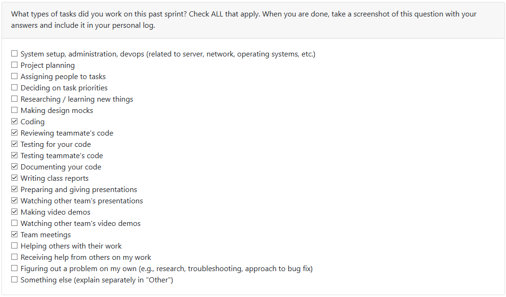

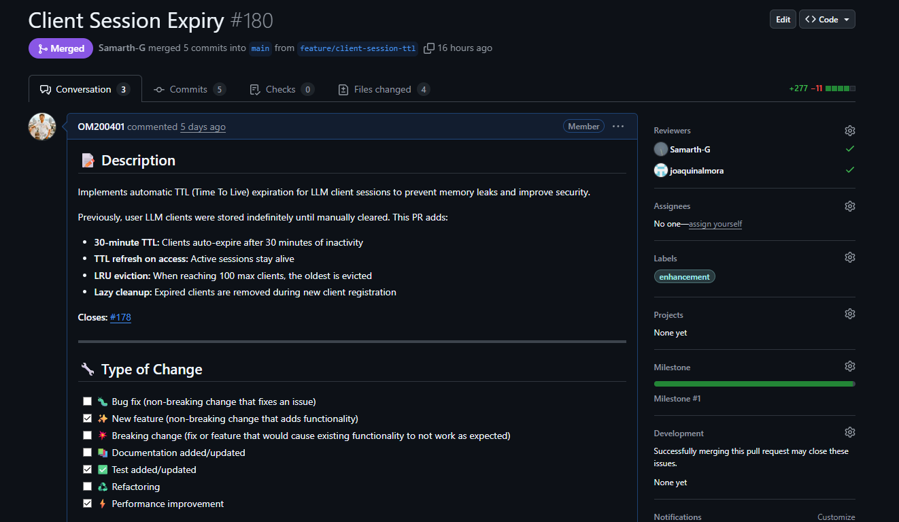

## Week 13: November 24 - November 30

This week, I implemented the duplicate detection feature to identify similar or identical files within a project directory. This helps users clean up redundant files and manage their projects more effectively. This was implemented using MD5 content hashing to identify duplicates efficiently. Furthermore, I worked on refining and adding more enhancements to the existing system - Report Generation in HTML format which can then be saved as a PDF file by the user. Search and Filtering capabilities were also added to the Textual UI to help users navigate large scan results more easily.

**Key Accomplishments:**

1. **Duplicate Detection Module**: Developed `DuplicateDetector` class that scans project directories, computes MD5 hashes for files, and identifies duplicates. Integrated with CLI and Textual UI for user interaction.

2. **Report Generation Enhancements**: Extended HTML report generation to include contribution metrics and duplicate file sections. Added PDF export functionality using `pdfkit`.

3. **Search & Filtering**: Implemented search bar and filtering options in Textual UI to allow users to filter scan results by file type, size, date modified, and keywords.

4. **Testing & Quality Assurance**: Created 18 new tests covering duplicate detection, report generation, and UI filtering features. Achieved 100% pass rate.

**Challenges & Learning:**
Faced challenges in efficiently handling large directories with many files. Resolved by optimizing file reading and hashing processes. Learned the importance of user-friendly UI design for search and filtering functionalities.

**Impact:**
Users can now easily identify and manage duplicate files, generate comprehensive reports, and navigate large scan results effectively. This enhances the overall usability and functionality of the portfolio analysis system.

Issues resolved include: [#173](https://github.com/COSC-499-W2025/capstone-project-team-7/issues/173), [#174](https://github.com/COSC-499-W2025/capstone-project-team-7/issues/174) and [#167](https://github.com/COSC-499-W2025/capstone-project-team-7/issues/167)

PR [#168 - Duplicate Detection](https://github.com/COSC-499-W2025/capstone-project-team-7/pull/168)

PR [#177 - Report & UI Enhancements](https://github.com/COSC-499-W2025/capstone-project-team-7/pull/177)

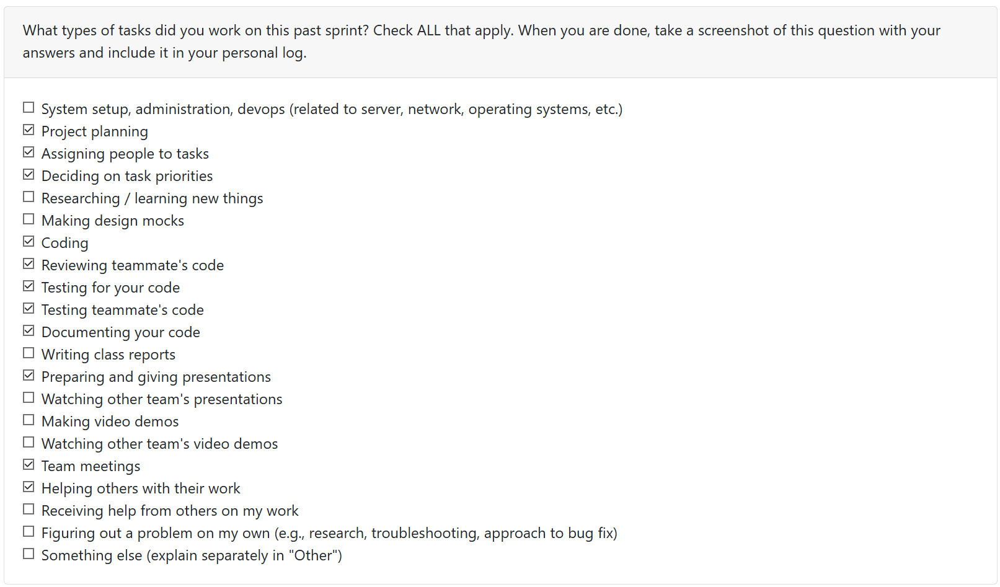

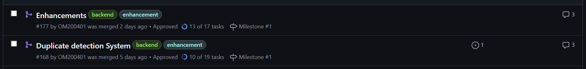

## Week 12: November 17 - November 23

This week, I implemented a comprehensive contribution metrics system that analyzes both Git and non-Git projects. The feature extracts individual contributor data, activity breakdowns, and project timelines to provide insights into development patterns.

**Key Accomplishments:**

1. **Contribution Analyzer Module**: Built pattern-based file classification system categorizing code, tests, docs, design, and config files. Implemented dual-mode analysis supporting Git commit history and file metadata fallback for non-Git projects.

2. **Skills Enhancement**: Extended the skills extractor to detect "Sustained Contribution" patterns from contributor activity, identifying developers with 7+ active days across a project timeline.

3. **Git Analysis Enhancement**: Modified `git_repo.py` to track per-contributor metrics including first/last commit dates and active days calculation using author-specific git log filtering.

4. **CLI Integration**: Created `ContributionAnalysisService` with three-tier display formatting (narrative, summary, detailed breakdown) and integrated into Textual UI with auto-extraction during scans.

5. **Comprehensive Testing**: Wrote 24 tests (16 Git + 8 non-Git scenarios) achieving 100% pass rate.

**Challenges & Learning:**
Initially struggled with making Git analysis optional—the system raised errors for non-Git projects. Resolved by implementing graceful fallback logic that detects project type automatically. Learned importance of defensive programming when dealing with optional data sources.

**Impact:**
Users can now analyze any project folder (Git or not) and get meaningful contribution insights without external APIs. All processing remains local, maintaining privacy-first principles.

Issues resolved include: [#143](https://github.com/COSC-499-W2025/capstone-project-team-7/issues/143), [#56](https://github.com/COSC-499-W2025/capstone-project-team-7/issues/56), [#46](https://github.com/COSC-499-W2025/capstone-project-team-7/issues/46) and [#45](https://github.com/COSC-499-W2025/capstone-project-team-7/issues/45)

[PR #140 - Contribution Metrics](https://github.com/COSC-499-W2025/capstone-project-team-7/pull/140)

[PR #144 - Multi project Detection](https://github.com/COSC-499-W2025/capstone-project-team-7/pull/144)

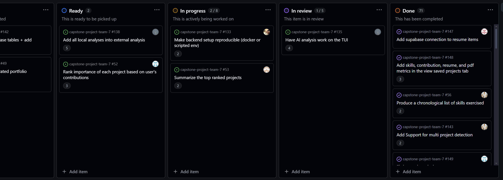

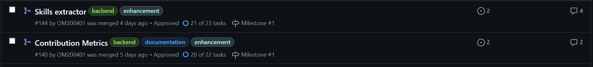

**Next Week Priorities**

- Clean up and refactor Supabase connections and tables
- Make sure no breaks or bugs internally and system is ready for presentation
- Finish any minor remaining integrations that come up in the process

## Reading Break

### Task Breakdown
- New Feature Development (Skills Extractor)
- Bug Fixes (Consent Persistence)
- Testing & Quality Assurance
- Documentation

### Recap of Weekly Goals

1. Design and implement comprehensive skills extraction system
2. Integrate skills analysis into existing Textual CLI workflow
3. Fix consent persistence bugs for session restoration
4. Achieve >90% test coverage for new features
5. Create user-friendly skill summaries with narrative descriptions

### Features Worked on This Week

#### Insights and Summaries
Implemented skills extraction system with 50+ pattern detection rules across 5 categories (OOP, Data Structures, Algorithms, Design Patterns, Best Practices). Features evidence-based proficiency scoring and narrative summaries.

#### Data Privacy and Control
Fixed consent persistence by implementing proper session token management, Supabase authentication patterns, and database-backed storage with RLS policies.

#### Configuration Management
Enhanced preferences system with skills analysis state management, auto-extraction settings, and export configuration.

**Issue:** [#50 - Skills Extraction Implementation](https://github.com/COSC-499-W2025/capstone-project-team-7/issues/50)

**Pull Request:** [PR #136 - Skills Extractor](https://github.com/COSC-499-W2025/capstone-project-team-7/pull/136#issue-3629172918)

### Next Week Priorities
1. Performance optimization for large codebases
2. Duplicate detection feature
3. Search and filtering for scan results

## Week 10: November 3 - November 9

The focus for this week (PR #123) was to integrate the PDF analyser (in house) created last week. I was able to change the inputs and outputs to automatically idenitfy PDF files in the zip folder (Or directory) the user decides to use. Once this is done, the PDF analyser engine extracts metadata for each file including information on word count for the most often used words and then generates summaries for each document. Currently this output is shown in JSON format and this will further be connected to our Supabase that allows the storage of this data - my peer Aaron is working on the design regarding the table usage for this matter. The consent management module introduced earlier in the project now has user persistence which was added in PR #125 now keeps track of the consent from a user using supabase.

**Core Implementation**:

- Automatic PDF detection in scan results
- Batch PDF processing with feedback
- Summary display with metadata (page count, word count and complexity)
- Storage of results for cross-session access
- Export capability for PDF analysis results
- Modified code for the addition of database operations, added implementation for automatic consent loading on login
- Added code for memory cleanup on logout
- Debugged RLS policy violations
- Implemented token management
- Added comprehensive test suite to test all of the above added enhancements and features

**Roadblocks Resolved**:

- RLS Security violations due to missing user access tokens: access token was added to all consent functions
- Ensuring smooth integration with existing consent system: Wrapped PDF analysis in consent checks to ensure users have granted external service consent before LLM based summarization
- Managing multiple PDF results across CLI sessions: To avoid this from happening results were stored in application state for access throughout session

Reflecting upon this past week and the work done for the same I think everything went really well alongside a few detours from the original plan I had in mind. The systematic approach of breaking down the user consent persistence helped a lot (persistence -> authentication -> testing -> documentation) and so did the PR review for my work from my peers. Reading detailed documentation for supabase API methods beforehand would have saved some rework so will keep that in mind for the future. For the upcoming sprint, I will be spending sometime looking into how my existing analysis for the documents and PDF analyser can be used to extrapolate more information on the user's work style, contribution and other information regarding a project instead of just generating summaries of PDF files.

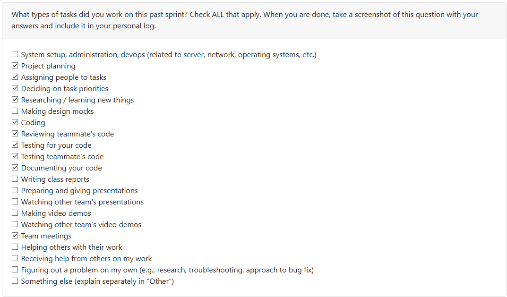

## Week 9: October 27 - November 2

This week, the focus was on local document analysis for file types beyond PDFs, specifically Word documents and plain text files. `PR #107` introduces a versatile document analyzer capable of handling multiple formats including `.txt`, `.md`, `.markdown`, `.rst`, `.log`, and `.docx`. This addition complements the existing PDF analysis capabilities, providing users with a comprehensive local analysis toolset.

Key accomplishments include:

**Core Implementation**:
- Multi-format document analyzer supporting `.txt`, `.md`, `.markdown`, `.rst`, `.log`, and `.docx` files
- Comprehensive metadata extraction: word/character/line/paragraph counts, reading time estimation
- Markdown-specific features: heading extraction, code block/link/image detection
- Automatic encoding detection with fallback mechanism for international characters
- Batch processing with configurable size limits
- CLI tools with `info`, `analyze`, `summarize`, and `batch` commands plus JSON export
- Code for the document analyzer was merged after review of PR and I also worked on integrating the previously developed PDF summarizer into the CLI workflow for a unified experience across document types

**Integration**:
- Reused existing PDF summarizer for consistent text analysis across all document types
- Graceful degradation for optional dependencies (python-docx)
- Windows console UTF-8 support for proper character rendering

**Roadblocks Encountered & Resolved**

1. **Summarizer Integration Issue**: Summary generation failures weren't handled gracefully. Resolved by implementing fallback keyword extraction and empty summary handling when the PDF summarizer fails.

2. **Encoding Challenges**: Multi-language documents caused UnicodeDecodeError. Fixed by implementing automatic encoding detection with fallback chain (`utf-8` → `latin-1` → `cp1252` → binary with error ignore).

3. **Paragraph Count Accuracy**: Simple line-break splitting produced inaccurate paragraph counts. Resolved using regex to split on multiple consecutive newlines and filtering empty paragraphs.

4. **PDF Analyzer Integration Not Yet Merged**: Work completed on `cli-workflow` branch but integration with main codebase pending due to some further conversations with the team regarding the design choices.

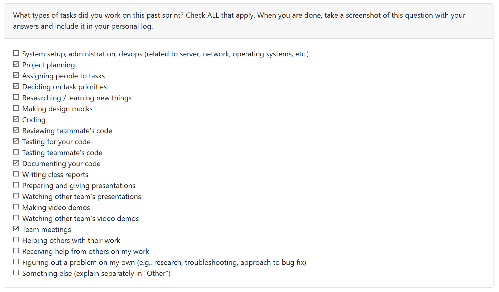

## Week 8: October 20 - October 26

This week I implemented a privacy-first local PDF analysis pipeline, CLI tooling, and a secure consent integration with comprehensive tests. `PR #96` covers the PDF analysis features, while `PR #89` focuses on consent/auth integration.

Key functionality added:

- PDF parsing: `backend/src/local_analysis/pdf_parser.py` now includes `PDFParser` with configurable limits (file size, pages, batch), metadata extraction (`PDFMetadata`), parsing from `Path` or bytes, and batch processing. A `create_parser()` factory simplifies instantiation.

- Summarization: `backend/src/local_analysis/pdf_summarizer.py` provides `PDFSummarizer` (TF‑IDF extractive scoring), text cleaning, sentence splitting, tokenization, keyword extraction, statistics, `generate_summary`, and batch summarization. Tuning via `SummaryConfig` and `create_summarizer()` is supported.

- CLI & docs: `backend/src/local_analysis/pdf_cli.py` offers `info`, `parse`, `summarize`, and `batch` commands with output-to-file options. Updated `CLI_REFERENCE.md` and `QUICK_REFERENCE.md` give quick presets and examples.

- Consent/auth integration: `PR #89` deals with the integration of consent validation module from last week and the consent notice added for the LLM usage from the user that was added by Jake. `backend/src/auth/consent.py` and `consent_validator.py` were updated to improve validation logic and integrate seamlessly with the CLI. Consent validation now includes stricter checks for user permissions and better error handling. The CLI (`auth_cli.py`) was updated to interact with these modules for consent upsert, check, and revoke flows.

**Roadblocks cleared**
- Replaced deprecated `PyPDF2` with `pypdf` and adapted imports/errors to remove warnings.
- Fixed sentence-length filtering and sentence-splitting discrepancies that broke summarizer tests by aligning tests with `SummaryConfig` or relaxing filters.
- Removed unsafe `--password` use on command lines and added interactive prompts plus warnings for CI usage.
- Resolved test import path issues by adding `tests/conftest.py` helpers for clean imports from `local_analysis`.

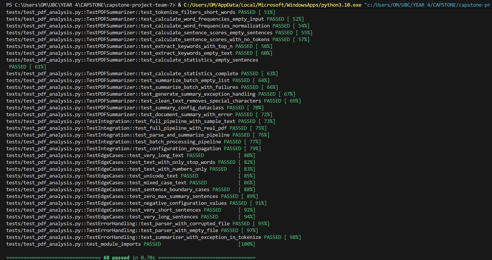

c

## Week 7: October 13 - October 19

This week, I successfully designed and implemented the **Consent Validation Module**, a critical component for ensuring user privacy and data protection compliance in our portfolio analysis system. `PR #70` (Consent validation module) was created to encapsulate this functionality and clearly defines the features and responsibilities of the module.

#### Module Development:
- Created a comprehensive `ConsentValidator` class with full type annotations and dataclass structures
- Implemented four custom exception classes (`ConsentError`, `ExternalServiceError`, `AuthorizationError`, `DatabaseError`) for granular error handling
- Developed the `ConsentRecord` dataclass to represent user consent with fields for file analysis, metadata processing, privacy acknowledgment, and external services

#### Core Functionality:
- `validate_upload_consent()`: Validates all required consent fields before file uploads
- `check_required_consent()`: Verifies users have granted necessary permissions
- `validate_external_services_consent()`: Manages optional third-party service consent
- Utility methods: `is_file_processing_allowed()` and `is_metadata_processing_allowed()` for permission checks
- Prepared database integration hooks with `_get_latest_consent_record()` placeholder for future Supabase implementation

#### Testing & Quality Assurance:
- Developed comprehensive unit test suite with 20+ test cases covering all validation scenarios
- Created test fixtures with sample data for different consent scenarios
- Achieved extensive code coverage including edge cases, error conditions, and integration workflows
- Validated proper exception handling and error messages for all failure scenarios

#### Technical Highlights:
- Used Python dataclasses and type hints for code clarity
- Implemented logging for audit trails and debugging
- Followed SOLID principles with factory pattern (`create_consent_validator()`)
- Designed with future database integration in mind

The module is now ready for integration with the file upload system and provides a robust foundation for privacy-compliant data processing.

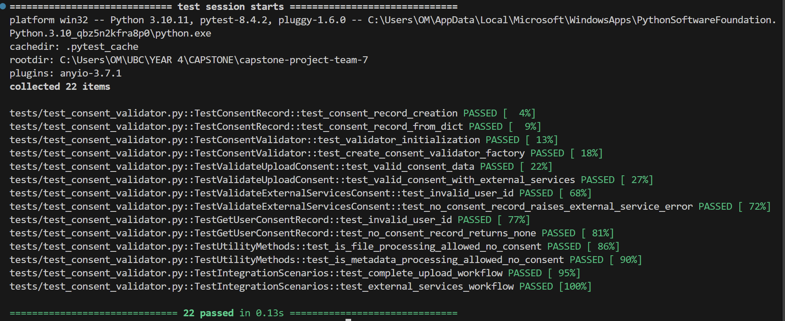

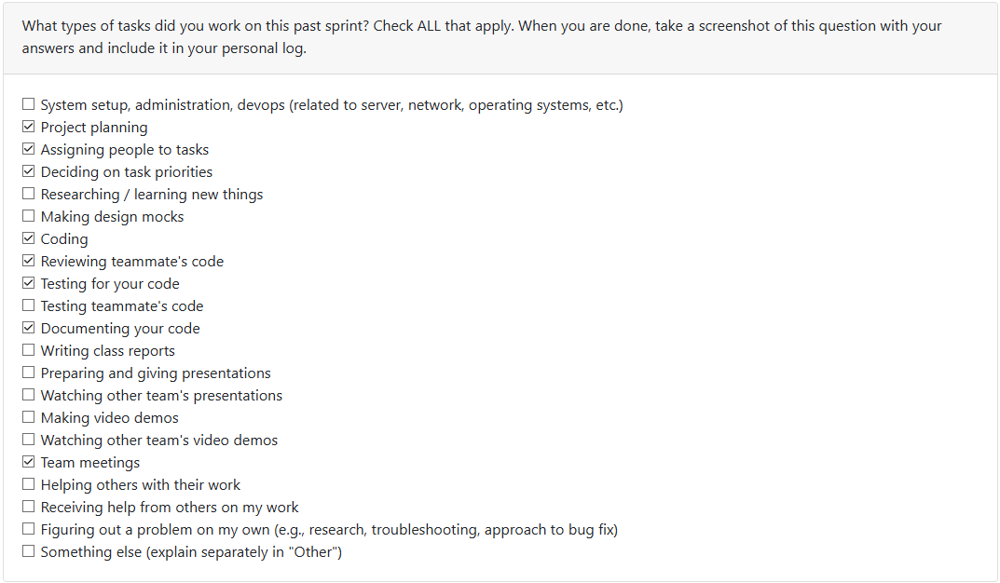

## Week 6: October 6 - October 12

*This week was spent refining the project documents including the Data Flow Diagram, Requirements and the System Architecture diagram as well. After taking a look at the milestone 1 requirements we realised there were some missing components such as the consent process from the user and we were able to add it to our current design for the system. I specifically worked on refining the WBS based on the new requirements and the document has now been added to the codebase. Except that I was able to contribute to the discussions of our repository structure which will allow us to move forward with adding actual code and logic starting next week. I also spent quite a bit of time this week diving into the documentation for Docker and understanding how it works.*

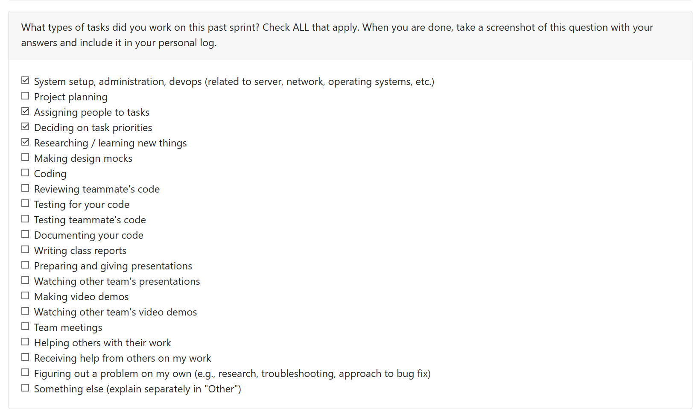

## Week 5: September 29 - October 5

*Most of the time this week had gone towards working on our Data Flow Diagrams (Level 0 and 1). I started off with listing out the basic processes that would be communicating with each other in the system. Once we had our processes listed out, we decided as a team if there were any other processes in the intermediary or if we had any redundant processes that could be eliminated. After this exercise, we landed on the conclusion of our final 7 processes. Now we just had to start drawing out our lines connecting the processes while making sure we are not missing out any internal processes that happened such as the rescanning that kept happening while the system was being used. Once all the data processes were connected we moved on to bridge the gap between the storage for our data with the inputs and outputs of the processes.*

## Week 4: September 22 - 28

*I spent a bunch of my time on the system architecture this week. Once we had that in place with the requirements from last week, I then started doing some research on what tech stack would satisfy our needs. After some discussions with the team and some more research we narrowed down on the technology we will be using. Furthermore, I worked on the functional requirements, test cases for them and the technology stack parts of the Project Proposal.*

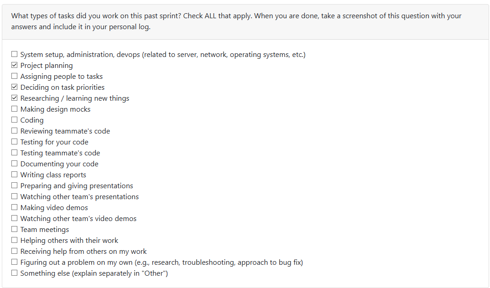

## Week 3: September 15 - 21 

*I worked on adding the functional requirements in the project requirements document alongside coming up with some ideas for the non-funcntional requirements. I also added the usage scenario and target user group for the project as well. I setup some starter directories and files for our documentation and log setup.*

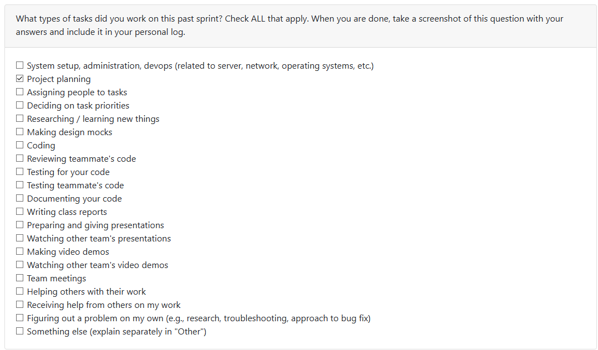
