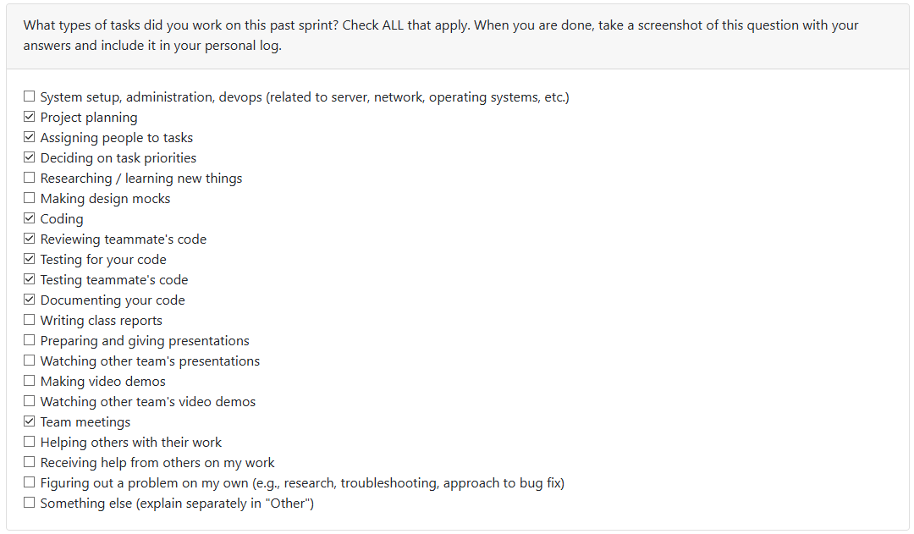

# Om Mistry (@OM200401)

## Week 8: October 20 - October 26

This week I implemented a privacy-first local PDF analysis pipeline, CLI tooling, and a secure consent integration with comprehensive tests. Key functionality added:

- PDF parsing: `backend/src/local_analysis/pdf_parser.py` now includes `PDFParser` with configurable limits (file size, pages, batch), metadata extraction (`PDFMetadata`), parsing from `Path` or bytes, and batch processing. A `create_parser()` factory simplifies instantiation.

- Summarization: `backend/src/local_analysis/pdf_summarizer.py` provides `PDFSummarizer` (TF‑IDF extractive scoring), text cleaning, sentence splitting, tokenization, keyword extraction, statistics, `generate_summary`, and batch summarization. Tuning via `SummaryConfig` and `create_summarizer()` is supported.

- CLI & docs: `backend/src/local_analysis/pdf_cli.py` offers `info`, `parse`, `summarize`, and `batch` commands with output-to-file options. Updated `CLI_REFERENCE.md` and `QUICK_REFERENCE.md` give quick presets and examples.

- Consent/auth integration: `backend/src/auth/consent.py` and `consent_validator.py` were updated to improve validation logic and integrate seamlessly with the CLI. Consent validation now includes stricter checks for user permissions and better error handling. The CLI (`auth_cli.py`) was updated to interact with these modules for consent upsert, check, and revoke flows.

Roadblocks cleared
- Replaced deprecated `PyPDF2` with `pypdf` and adapted imports/errors to remove warnings.
- Fixed sentence-length filtering and sentence-splitting discrepancies that broke summarizer tests by aligning tests with `SummaryConfig` or relaxing filters.
- Removed unsafe `--password` use on command lines and added interactive prompts plus warnings for CI usage.
- Resolved test import path issues by adding `tests/conftest.py` helpers for clean imports from `local_analysis`.

## Week 7: October 13 - October 19

This week, I successfully designed and implemented the **Consent Validation Module**, a critical component for ensuring user privacy and data protection compliance in our portfolio analysis system.

#### Module Development:
- Created a comprehensive `ConsentValidator` class with full type annotations and dataclass structures
- Implemented four custom exception classes (`ConsentError`, `ExternalServiceError`, `AuthorizationError`, `DatabaseError`) for granular error handling
- Developed the `ConsentRecord` dataclass to represent user consent with fields for file analysis, metadata processing, privacy acknowledgment, and external services

#### Core Functionality:
- `validate_upload_consent()`: Validates all required consent fields before file uploads
- `check_required_consent()`: Verifies users have granted necessary permissions
- `validate_external_services_consent()`: Manages optional third-party service consent
- Utility methods: `is_file_processing_allowed()` and `is_metadata_processing_allowed()` for permission checks
- Prepared database integration hooks with `_get_latest_consent_record()` placeholder for future Supabase implementation

#### Testing & Quality Assurance:
- Developed comprehensive unit test suite with 20+ test cases covering all validation scenarios
- Created test fixtures with sample data for different consent scenarios
- Achieved extensive code coverage including edge cases, error conditions, and integration workflows
- Validated proper exception handling and error messages for all failure scenarios

#### Technical Highlights:
- Used Python dataclasses and type hints for code clarity
- Implemented logging for audit trails and debugging
- Followed SOLID principles with factory pattern (`create_consent_validator()`)
- Designed with future database integration in mind

The module is now ready for integration with the file upload system and provides a robust foundation for privacy-compliant data processing.

## Week 6: October 6 - October 12

*This week was spent refining the project documents including the Data Flow Diagram, Requirements and the System Architecture diagram as well. After taking a look at the milestone 1 requirements we realised there were some missing components such as the consent process from the user and we were able to add it to our current design for the system. I specifically worked on refining the WBS based on the new requirements and the document has now been added to the codebase. Except that I was able to contribute to the discussions of our repository structure which will allow us to move forward with adding actual code and logic starting next week. I also spent quite a bit of time this week diving into the documentation for Docker and understanding how it works.*

## Week 5: September 29 - October 5

*Most of the time this week had gone towards working on our Data Flow Diagrams (Level 0 and 1). I started off with listing out the basic processes that would be communicating with each other in the system. Once we had our processes listed out, we decided as a team if there were any other processes in the intermediary or if we had any redundant processes that could be eliminated. After this exercise, we landed on the conclusion of our final 7 processes. Now we just had to start drawing out our lines connecting the processes while making sure we are not missing out any internal processes that happened such as the rescanning that kept happening while the system was being used. Once all the data processes were connected we moved on to bridge the gap between the storage for our data with the inputs and outputs of the processes.*

## Week 4: September 22 - 28

*I spent a bunch of my time on the system architecture this week. Once we had that in place with the requirements from last week, I then started doing some research on what tech stack would satisfy our needs. After some discussions with the team and some more research we narrowed down on the technology we will be using. Furthermore, I worked on the functional requirements, test cases for them and the technology stack parts of the Project Proposal.*

## Week 3: September 15 - 21 

*I worked on adding the functional requirements in the project requirements document alongside coming up with some ideas for the non-funcntional requirements. I also added the usage scenario and target user group for the project as well. I setup some starter directories and files for our documentation and log setup.*

