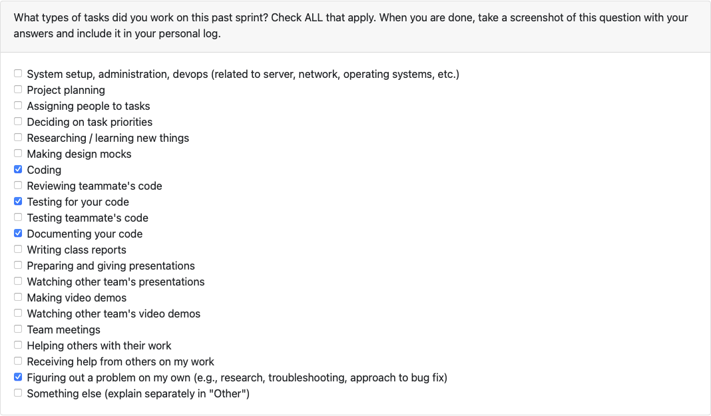
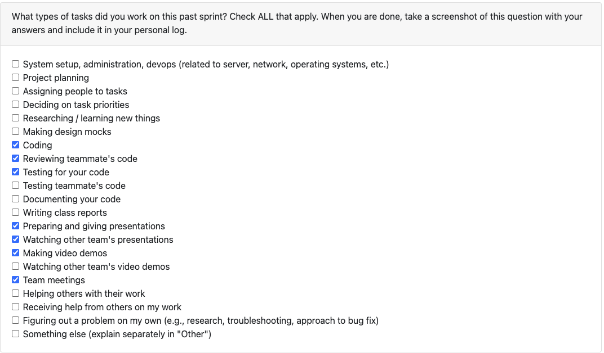
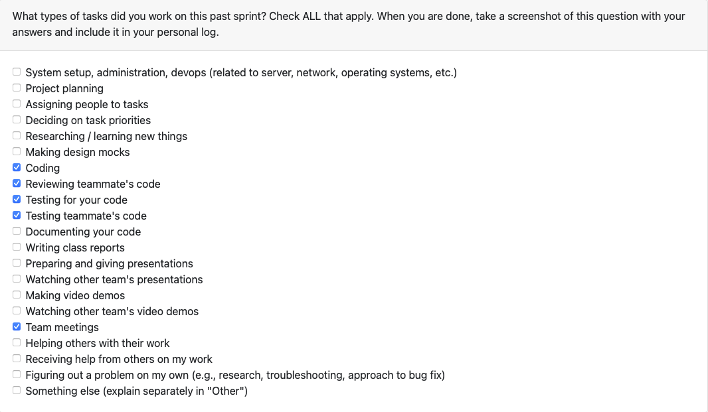
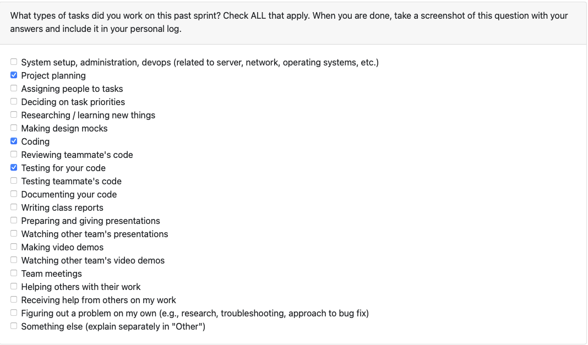
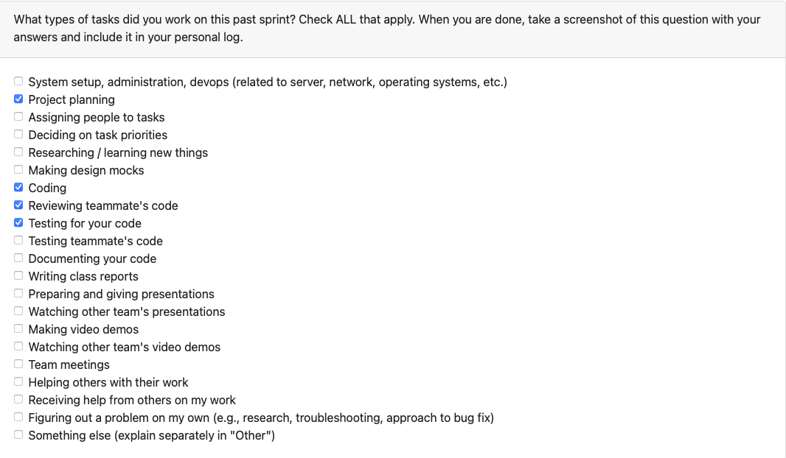
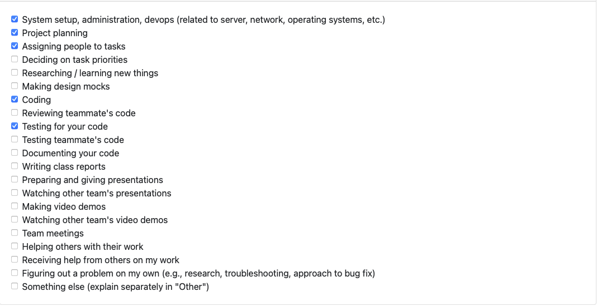
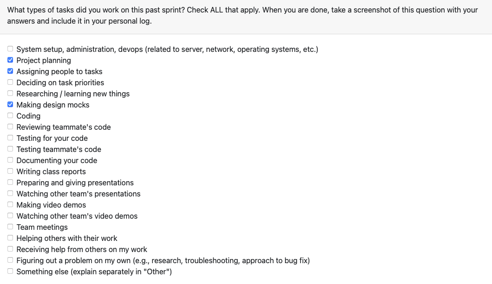
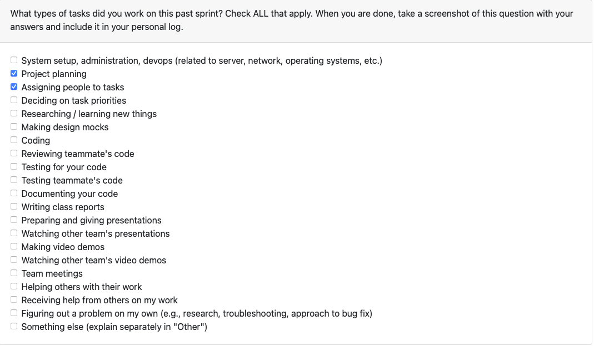
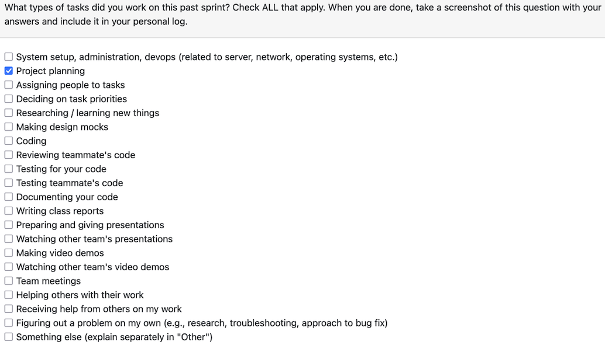

# Samarth Grover (@Samarth-G)

## Week 16: January 12 - January 18
This week I was focused on implementing the Portfolio Analysis API into the TUI with optional LLM enhancement. The main work landed through the **[PR 215 Portfolio analysis api with TUI integration](https://github.com/COSC-499-W2025/capstone-project-team-7/pull/215)**, adding a comprehensive analysis endpoint that runs local analysis by default and gracefully upgrades to LLM-powered insights when the user has granted consent and configured an API key.

I implemented POST `/api/analysis/portfolio` in `analysis_routes.py`, which orchestrates the full analysis pipeline: language detection, git history analysis, code metrics via tree-sitter, skills extraction, contribution analysis, and duplicate detection. The endpoint is "local-first" and LLM features are an optional enhancement. I added a detailed llm_status field that tells the client exactly why LLM was skipped or failed (skipped:consent_not_granted, skipped:no_api_key, failed:analysis_error, etc.), so the TUI can display appropriate messaging.

For TUI integration, I created `AnalysisAPIService` in `analysis_api_service.py` as an HTTP client that handles the upload, parse and analysis workflow. The service manages JWT tokens, handles error responses with proper exception types (`AnalysisServiceError`, `AnalysisConsentError`), and parses the rich API response into typed dataclasses. I wired this into `textual_app.py` with a new `_run_ai_analysis_via_api()` method that's triggered when PORTFOLIO_USE_ANALYSIS_API=true. The TUI shows progress during upload/parse/analysis and formats results using the existing AI display helpers.

Additionally, I added tests in `test_analysis_api.py` to cover the main flows (18 tests) including language detection, duplicate detection, LLM consent/key requirements, and ZIP security. Also added `test_analysis_api_service.py`, which covers tests for the TUI integration layer (14 tests).

### Reflection
**What went well:** 
The typed dataclasses in the service layer made response parsing straightforward and caught schema mismatches early. The TUI integration reused existing AI display methods, so results render consistently whether analysis runs locally or via API. Tests stayed focused and fast by mocking the HTTP layer.

**What didn’t go well:**  
The analysis endpoint does a lot (language, git, code metrics, skills, contributions, duplicates), which made the route file long and harder to test in isolation. Tree-sitter availability varies across environments, so code metrics silently degrade when it's missing, which could confuse users expecting full results.

### Next Steps

- I'll be working on adding support evidence of success for projects: add structured support for “evidence of success” on projects, including quantitative metrics, feedback, evaluations and evidence must be editable via API and included in portfolio and résumé outputs.

## Week 14: December 1st - 7th
This week I focused on stabilizing the AI analysis workflow and enhancing user control over analysis depth. The work centered on fixing multi-project bugs, restoring real-time progress tracking, and introducing different analysis modes, all delivered in this PR: **[PR 187 fix bugs in ai analysis](https://github.com/COSC-499-W2025/capstone-project-team-7/pull/188)**

The key technical improvement was fixing critical issues in multi-project mode where the analysis workflow was breaking down. I refactored the progress tracking system that had stopped working, implementing real-time status messages that now provide visibility throughout the entire analysis process. Users can see exactly what's happening at each stage rather than staring at a frozen screen.

I also built a new `AnalysisModeChoiceScreen` that gives users meaningful control over analysis depth. The interface presents two clear options: "Text-Only" mode for fast, code-focused analysis, and "Media Deep Dive" mode for comprehensive analysis including images and multimedia assets. This architectural choice puts decision-making power in the user's hands while keeping the implementation clean and extensible for future analysis modes.

Beyond coding, this week involved significant team work. We gave our Milestone 1 presentation, watched and peer-reviewed other teams' presentations, participated in team meetings to plan our demo layout, and recorded my 2 minute segment of our 10 minute demo video helping Aaron with editing. We also finalized and signed our team contract, establishing clear expectations moving forward.

### Reflection

**What went well:** 

The progress tracking refactor was easy to implement, I identified where the system was breaking and the fix mapped naturally to the existing event flow. The analysis mode selection screen came together quickly with good UI. The milestone 1 presentation also went well, we recieved a good grade for that and overall were happy with what we were able to show.

**What didn’t go well:** 

Coordinating the major team activities this week like the presentation and the demo recording compressed the available coding time more than planned, though the deliverables themselves went smoothly. It also was a bit frustrating to crunch all the info we had in the demo down to 10 mins, but we found ways to cut out parts that were not the most important.

### Next Steps

- Finals
- Winter Break  

## Week 13: November 24 - 30
This week I upgraded the AI analysis results screen from plain text output into an interactive and structured interface. The work focused on data organization, navigation UX, and smart content prioritization, all delivered in this PR: **[PR #157 – format view last ai analysis](https://github.com/COSC-499-W2025/capstone-project-team-7/pull/166)**

The core architectural change was refactoring `format_analysis()` to return structured JSON instead of markdown. Analysis results now organize into distinct sections; portfolio overview, projects, key files, supporting files, and skipped files; with intelligent file prioritization that highlights the top 3-5 most important files per project. This shift from flat text to hierarchical data enabled much better presentation possibilities.

I rebuilt `AIResultsScreen` with a dynamic sidebar navigation system that adapts contextually for single vs. multi-project portfolio modes. Each section became expandable with collapsible file views, making it easy to drill into specific areas without scrolling through walls of text. The interface feels responsive and purposeful rather than overwhelming.

Storage format changed from .md to .json to support the structured approach. I added a dedicated `_display_ai_sections()` method that handles Rich-markup rendering, cleanly separating data retrieval from presentation logic. This made the results viewer more maintainable and set up better patterns for future analysis features.

### Reflection

**What went well:**  
The JSON structure mapped naturally to the Textual UI Library's widget hierarchy, and the sidebar navigation pattern felt intuitive immediately. Smart file prioritization worked better than expected, highlighting key files per project made large analyses much more scannable. The separation between data format and display logic paid of when testing as it made the results seamless. 

**What didn’t go well:** 
Migrating existing .md results to the new JSON format required backward compatibility handling that wasn't initially planned. Testing different portfolio structures (single project, multi-project, edge cases with no files) required more test data setup than anticipated. It also took several rounds of testing and since each run takes a while due to AI api delays, it was more tedious then expected.

### Next Steps

- Practice the presentation  
- Record the video demo  
- Finalize the team contract  

## Week 12: November 17 - 23
This week I worked on major improvements to the AI analysis capabilities, making it a fully integrated feature in the TUI. The work centered on persistent configuration, batch processing performance, and a polished results viewing experience. All of this shipped through **PR #153 – ‘AI analysis work on the tui’**.

The biggest addition was automatic API key management through a new ~/.portfolio_cli_ai_config.json file. Instead of re-entering credentials every session, the AI client now initializes automatically on startup with saved settings. I integrated temperature and max_tokens configuration directly into the Settings dialog, giving users control over analysis behavior without touching config files manually.

Results viewing got a complete overhaul with the new AIResultsScreen, a dedicated full-screen modal for browsing analysis output. The new "View Last AI Analysis" menu option lets you review previous results without re-running expensive API calls, which made the workflow much less wasteful.

Performance improved dramatically through parallel batch processing. File analysis now runs 5 concurrent requests using asyncio, with real-time progress tracking showing detailed status messages and a visual progress indicator. Long analysis runs no longer feel frozen, and the speedup on larger portfolios with multiple projects was immediately noticeable.

Finally, I fixed critical bugs in the multi-project analysis mode. Path normalization was broken across project boundaries, causing files to be grouped incorrectly. Archive path handling got corrected to match the new caching logic, and error handling became more robust with generic exception parsing for better SDK compatibility.

### Reflection

**What went well:**  
The persistent config layer fit cleanly into the existing startup flow, and Textual's modal system made the results viewer straightforward to implement. Asyncio batch processing was easier than expected to bolt onto the existing analysis pipeline, and the progress tracking hooks integrated nicely without blocking the UI thread.

**What didn’t go well:**  
Handling SDK exceptions generically required more defensive parsing than anticipated, since error structures varied across different failure modes. Testing the result output format was frustrating as I had to rerun the entire workflow with the local scan and AI analysis each time, which wasted a lot of time and took much longer than it should have.

### Next Steps
- Improve the AI analysis component and prepare it for the final presentation.
- Decide on additional features to include in the AI output, integrating results from the local analysis.
- Determine an efficient method to combine all local analysis segments into the AI workflow.
- Ensure the integrated results align cleanly with the current portfolio/project overview.

## Week 10: November 3 - November 9

This week I enhanced the AI analysis system with multi-project support and configurable LLM parameters. I started by expanding `summarize_scan_with_ai()` to accept a project_dirs parameter, enabling the system to handle portfolios containing multiple independent projects rather than treating everything as a single codebase.   Next, I implemented `_analyze_multiple_projects()`, which intelligently organizes files by their respective projects, performs targeted per-project analysis, and handles any unassigned files separately to ensure comprehensive coverage of the entire portfolio.   After which, I built `_generate_portfolio_summary()` to produce high-level portfolio insights when multiple projects are detected, highlighting overall technical strengths, breadth of skills across projects, and noting any loose files that exist outside the main project structures.   On top of that, I added configurable LLM parameters including temperature and max tokens, implementing CLI prompts with validation to give users control over analysis behavior while maintaining consistency across all LLM calls.   Finally, I switched the default model to gpt-4o-mini for improved cost-efficiency and ensured all new parameters are properly validated and consistently applied throughout the analysis pipeline. These enhancements enable the tool to provide more coherent, context-aware results for complex portfolios while giving users flexibility in how their code is analyzed.

## Week 9: October 27 - November 2

This week I integrated the LLM analysis module into the main application workflow. I started by modifying client.py to add the `summarize_scan_with_ai()` method, which orchestrates the entire analysis process by reading file contents from scan results, analyzing individual files using `summarize_tagged_file()`, and generating project overviews through `analyze_project()`.  
Next, I enhanced `app.py` with the complete AI analysis menu system, adding it as option 5 in the main menu with the constant MENU_AI_ANALYSIS. I implemented session-level state management by adding `_llm_client` and `_llm_api_key` variables to maintain API credentials in memory throughout the user's session.  
After which, I built `_handle_ai_analysis()` as the main handler function, which performs sequential validation checks including login verification, external services consent confirmation, and scan existence validation before prompting users for their API key and executing the analysis pipeline.  
On top of that, I created `_render_ai_analysis_results()` to display analysis results using Rich panel formatting with color-coded sections and professional styling, along with `_export_ai_analysis()` to save results as formatted markdown reports.  
Finally, I implemented comprehensive privacy and security measures by ensuring API keys are never persisted to disk, requiring explicit consent before sending data to external services, and automatically filtering out binary files so only text content is analyzed. 

## Week 8: October 20 - October 26

This week I implemented the LLM-powered summarization and analysis capabilities for the project. I started by building the `summarize_tagged_file()` function, which returns structured outputs with key insights including Summary, Core Functionality, and Notable Patterns. It detects when a file exceeds 2000 tokens and automatically applies chunking.  
Next, I added `analyze_project()`, designed to generate resume-ready reports summarizing a project’s technical and qualitative aspects including an executive summary, technical highlights, tech stack used, and project quality assessment.  
After which, I implemented a helper function to handle large files efficiently `chunk_and_summarize()`, which splits text into 2000-token chunks with 100-token overlaps, summarizes each part independently, and merges the results into a coherent final output. On top of that, I added `suggest_feedback()` to provide personalized, career-aligned insights based on both local and AI results.  
Finally, I built supporting functions like `_count_tokens()` (using tiktoken with a character-count fallback) and `_make_llm_call()` to standardize LLM interactions. These functions will be used together in the app workflow to make up the LLM analysis module, with more functions that we might add in the future.

## Week 7: October 13 - October 19

This week I focused on setting up the LLM integration for the project. I started by building the LLMClient class, which wraps around the OpenAI API and handles everything from API key verification to error management. It validates keys up front, handles authentication, and keeps configuration clean through a shared global client state.  
Once the client was in place, I added new REST endpoints under /api/llm/ for verifying keys, checking model info, clearing credentials, and viewing service status.
To make sure everything was reliable, I wrote 30+ automated tests spanning both the client and the routes, covering initialization, key validation, failure cases, and full integration workflows. This sets up a solid foundation for future AI-driven analysis features.

## Week 6: October 6 - October 12

This week my team and I worked on amending our project to match the milestone 1 requirements and worked on setting up the basic code repo for the python backend. I personally worked on creating the basic Docker container setup and wrote the code for the needed dockerfiles. I also updated the System Architecture diagram based on the criteria of the milestone 1 requirements. Through the week I also took part in several discussions to map out our teams project setup and how we're going to approach all the different requirements listed as part of milestone 1.

## Week 5: September 29 - October 5

This week I worked with my team to develop the Data Flow Diagrams for Level 0 and Level 1. We began by listing out all the core processes in a shared document and refining them into the seven main processes that defined the overall data flow in our system. Once finalized, we used a tool called Lucidchart as a collabrative platform to create the visual diagrams. During this process we iterated through a few designs and variations, ensuring that the connections, inputs and outputs between processes were logically accurate. The final step for us was fixing up the shapes we used in our diagram based on the ones mentioned in lecture.

## Week 4: September 22 - 28

This week I worked with my team to brainstorm and iterate through the System Architecture Diagram. We first settled on a more information heavy diagram but later pivoted to a more visual diagram that was easier to understand, while using the older diagram as a reference for a detailed component breakdown. I also worked on the Project Scope and Usage Scenario section of the Project Proposal to layout the concrete outline for what our project aims to achieve. 

## Week 3: September 15 - 21 
This week I worked alongside my team to set up the foundation for the project including the git repository and docs setup. We discussed the project overview and wrote out the functional and non-functional requirements by going in depth and understanding what was needed to build the project.

Missed lecture due to sickness during this week.

