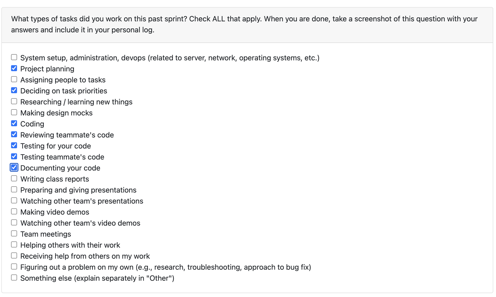
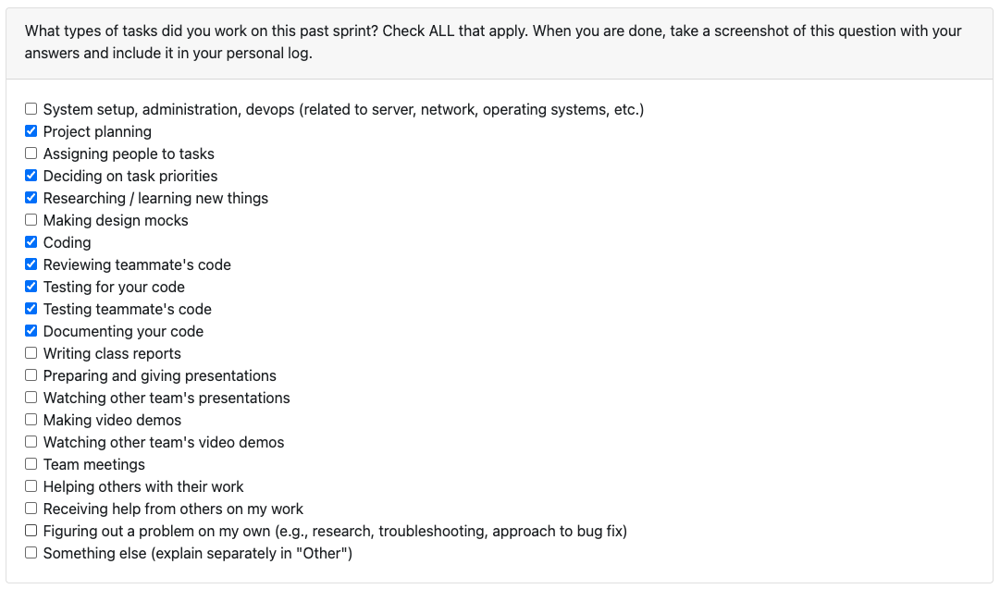

# Joaquin Almora / @joaquinalmora

### Weekly Navigation
- [Week 17](#week-17)
- [Week 16](#week-16)
- [Week 15](#week-15)
- [Winter Break](#winter-break)
- [Week 14](#week-14-december-1st---7th)
- [Week 13](#week-13-november-24th---30th)
- [Week 12](#week-12-november-17th---23rd)
- [Reading Break](#reading-break-november-10th---16th)
- [Week 10](#week-10-november-3rd---9th)
- [Week 9](#week-9-october-27th---november-2nd)
- [Week 8](#week-8-october-20th---26th)
- [Week 7](#week-7-october-13th---19th)
- [Week 6](#week-6-october-6th---12th)
- [Week 5](#week-5-september-29th---october-5th)
- [Week 4](#week-4-september-22nd---28th)
- [Week 3](#week-3-september-15th---21st)

## Week 17 (January 19th - 25th)
This week focused on building and integrating the Project Overrides layer into the existing project and timeline APIs. The work was delivered in [PR #241 – “Project-overrides: add database layer and service”](https://github.com/COSC-499-W2025/capstone-project-team-7/pull/241) and [PR #243 – “Add API endpoints and integration tests”](https://github.com/COSC-499-W2025/capstone-project-team-7/pull/243), introducing a full override system so users can customize project metadata and timeline dates beyond computed scan values.
On the backend, I added a `project_overrides` table with RLS, foreign keys, and indexes, and implemented a `ProjectOverridesService` to handle override logic and transparent encryption/decryption for sensitive fields. All service methods are covered by unit tests (15/15 passing).
On the API side, I added `GET`, `PATCH`, and `DELETE` endpoints, along with 19 integration tests. I updated `GET /api/projects/{id}` to return `user_overrides`, and modified the timeline endpoint to respect `end_date_override` for correct chronology ordering.
I also resolved a few issues: adjusted queries due to Supabase 2.0.0’s `maybe_single()` behavior, fixed a decryption bug affecting `role`, and removed `evidence` from encrypted fields to address a PostgreSQL type mismatch.

### Reflection
**What went well:**  
The separation between database, service, and API layers made testing straightforward. Encryption concerns stayed cleanly encapsulated in the service layer. Both unit and integration test suites are fully passing. 

**What didn’t go well:**  
The `maybe_single()` behavior in Supabase-py required more refactoring than expected. The encryption and PostgreSQL array type mismatch surfaced later in development and required schema-level reconsideration. The PR initially exceeded size guidelines before being split.

### Next Steps
- Clean up the “Override Test Project” records created during local testing.
- Consider adding stricter validation for override date fields at the API boundary.
- Do test runs ahead of peer testings
- Start drafting UI layout

## Week 16 (January 12th - 18th)
This week was about finishing the bridge between the TUI and the backend APIs and making those paths solid. Most of the work landed through **PR [#226 – “Added consent API routes to TUI”](https://github.com/COSC-499-W2025/capstone-project-team-7/pull/226)**, **PR [#232 – “Add authentication API endpoints”](https://github.com/COSC-499-W2025/capstone-project-team-7/pull/232)**, and **PR [#239 – “Add dedup API report and TUI integration”](https://github.com/COSC-499-W2025/capstone-project-team-7/pull/239)**. Together, these changes finish off the API-backed paths for consent, auth, and dedup, and make the TUI behave the same way in both legacy and API modes. I added `ConsentAPIService` and wired the TUI consent flow to use FastAPI whenever `PORTFOLIO_USE_API` is enabled, covering status, toggles, and the privacy notice. I also extended the consent state to track external-services consent and render badges straight from API state, while guarding persistence so Supabase storage is only used in legacy mode. On the backend side, I added `/api/auth` routes for signup, login, refresh, and session using `SupabaseAuth`, and extended the auth context to return the user email. The auth router is now wired into the FastAPI app, with tests covering the main flows. I updated the API plan and OpenAPI spec so the auth contracts are clearly documented. I also implemented `GET /api/dedup` to return hash-based duplicate groups and storage savings from project scans. To support that, I persisted `file_hash` in scan payloads (both TUI export and API scan responses). The TUI now fetches dedup data in API mode with a local fallback using a new `get_dedup_report` client helper. I added `tests/test_dedup_api.py` for coverage. All consent-related tests passed locally, including `tests/test_api_consent.py` and `tests/test_consent_integration.py`.

### Reflection
**What went well:**  
The TUI now switches cleanly between legacy and API-backed consent without leaking state. Auth is fully API-driven with tests and docs in place, which unblocks other services. Dedup is end-to-end: hashes flow through scans, the API reports groups and savings, and the TUI can consume it with a simple helper. Tests stayed small and fast.

**What didn’t go well:**  
`textual_app.py` already has a lot of static type noise, which made even small edits slow and fragile. The consent wiring touches a lot of UI and session paths, so missing a single guard (like during session refresh) can cause regressions. Pytest initially failed because `pypdf` wasn’t installed, and dedup tests still fail without it. 

### Next Steps
- Add a focused unit test for `ConsentAPIService` using mocked `httpx`.
- Consider pulling consent UI helpers out of `textual_app.py` to reduce edit friction.
- Optionally fix the `datetime.utcnow()` deprecation warnings in `backend/src/auth/consent.py`.
- Add coverage for legacy scans that don’t have `file_hash`, if needed.
  

## Week 15 (January 5th - 11th)
This week focused on implementing the Consent API as a standalone backend component, decoupled from any Textual or TUI assumptions. I implemented the consent endpoints (`GET /api/consent`, `POST /api/consent`, and `GET /api/consent/notice`) in `backend/src/api/consent_routes.py`, aligned with the updated OpenAPI specification. The routes resolve `user_id` via a shared auth-token dependency that queries Supabase `/auth/v1/user`, keeping consent enforcement centralized and reusable across services.

To avoid confusion and route conflicts, I removed the stub consent handlers from `backend/src/api/spec_routes.py`. I added a focused test suite in `tests/test_api_consent.py` and validated it locally using the backend venv, with all five tests passing. I also added `python-multipart` to `backend/requirements.txt` to keep FastAPI route imports clean and prevent runtime import errors.

### Reflection

**What went well:**  
The Consent API landed cleanly as a standalone module and aligns closely with the OpenAPI contract. Centralizing user resolution through a shared dependency keeps the design flexible and avoids frontend or TUI coupling. Tests are small, deterministic, and fast, and dependency overrides made it possible to validate Supabase-backed auth logic without relying on external services.

**What didn’t go well:**  
Initial test failures were caused by a missing `python-multipart` dependency and some wiring issues with async dependency overrides, which slowed validation. Supabase auth requirements (`SUPABASE_URL` and `SUPABASE_ANON_KEY`) add some setup overhead, though this was mitigated in tests via overrides. There is also a minor deprecation warning from `datetime.utcnow()` in `backend/src/auth/consent.py`, which is not blocking but should be addressed.

### Next Steps
Tackle more of the API routes specified in the API plan, continuing to replace scaffolded endpoints with real implementations and accompanying tests.

## Winter Break
This winter break I focused on locking down the backend API direction while unblocking client and desktop development through scaffolding. I captured the Milestone 2 backend behavior, requirements, and delivery order in `docs/api-plan.md`, and drafted an OpenAPI specification in `docs/api-spec.yaml` aligned to the payload shapes currently used across the system. Together, these documents now serve as the shared contract for backend implementation and frontend/Desktop integration.

To support early integration work, I added a stub FastAPI router in `backend/src/api/spec_routes.py` and wired it into the application. These endpoints intentionally mirror the spec but use in-memory, unauthenticated logic so clients can integrate against stable shapes before real services are implemented. In parallel, I stood up minimal Electron, Next.js, and shadcn/ui scaffolds with IPC wiring and starter components, capturing dependency lockfiles to ensure reproducible installs across environments.

I also added a small smoke test (`tests/test_api_scaffold.py`) to validate the shape of the stubbed `/api/scans` and `/api/projects` responses. The test is skip-safe when FastAPI dependencies are not installed, keeping CI flexible during this scaffold phase. Migration tracking documents (`docs/migration-plan.md` and `docs/feature-inventory.md`) were updated to keep the desktop transition and feature parity explicit.

### Reflection

**What went well:**  
Documenting the API plan and OpenAPI draft significantly reduced ambiguity around backend responsibilities and payload structure. Stub routes unblocked client and desktop work without forcing premature backend decisions. The scaffold test provides early feedback that the API contract is being respected, and having lockfiles in place reduced setup friction across environments.

**What didn’t go well:**  
The OpenAPI draft and lockfiles added a large number of lines, making the diff heavier and harder to review. Because the stub routes are in-memory and unauthenticated, they need to be clearly labeled to avoid confusion about production readiness. Ensuring spec schemas matched real payloads required careful cross-checking against existing tests and fixtures, which took longer than expected.

### Next Steps
Replace stub routes with real implementations: uploads, parsing, and scans backed by parser and analysis services, and projects, résumé, and config backed by Supabase with auth, consent, and limits enforced. Implement the job and progress model and standardized error handling defined in the behavior guide. Add non-stub API tests once implementations land and make the scaffold smoke test non-skipping in CI when FastAPI dependencies are present.

## Week 14 (December 1st - 7th)
This week focused on strengthening our system’s security layer through the implementation of AES-GCM encryption and improvements to team configuration workflows. I added a new `EncryptionService` and integrated it into résumé and project storage with backward-compatible envelopes. I updated the `.env.example` and README to document the required `ENCRYPTION_MASTER_KEY` and proper placement of `OPENAI_API_KEY`, and added `cryptography` to the project requirements. All focused pytest suites ran successfully within the repo’s venv.

Beyond encryption, I completed several team deliverables: writing the team contract, updating the README, recording my portion of the demo, and helping Vlad resolve setup issues. The demo required multiple retakes to ensure clarity and correctness. Assisting Vlad took significant time because his `.env.example` was not updating even though the Git commands appeared correct—eventually traced to a subtle cloning issue causing inconsistent repo state.

### Reflection

**What went well:**  
AES-GCM encryption integrated cleanly into the existing storage flow, and backwards compatibility behaved as expected. Clarifying environment variables improved setup consistency for the team. All focused tests passed under the correct venv, and the demo segment ultimately came together. Supporting Vlad ensured everyone remained aligned on proper environment and repo setup.

**What didn’t go well:**  
Environment conflicts initially slowed progress. System Python kept overriding the venv until an old zprofile alias was removed, and PEP-668 protections required explicitly using the repo’s Python and pip. The demo needed several retakes. Debugging Vlad’s `.env.example` issue took longer than expected because the error symptoms didn’t match typical Git misuse, making the root cause non-obvious.

### Next Steps
Over the break, start setting up the API structure.
  

## Week 13 (November 24th - 30th)
This week focused on strengthening our project-level analytics by improving the skill-progression pipeline, tightening contribution scoring, and cleaning up several Supabase-related issues. Most of the work landed through **PR [#172 – “Skill progression”](https://github.com/COSC-499-W2025/capstone-project-team-7/pull/172)** and **PR [#162 – “Contribution importance + supabase cleanup”](https://github.com/COSC-499-W2025/capstone-project-team-7/pull/162)**. Together, these changes made the analysis flow feel more accurate, more consistent across state and export, and better grounded in real Git data.

A big portion of the week went into refining the skill progression timeline. I unified filtering, scoring, and contributor attribution around a single user identity (`PORTFOLIO_USER_EMAIL`), fixing several inconsistencies we had before. I also enriched each timeline period with commit messages, top files, activity types, per-period languages, and contributor counts extracted directly from `git log`. A small progress indicator was added so long-running progression tasks feel more responsive. I also tightened the LLM summary prompt so summaries now consistently mention languages, overall trends, and top skills instead of producing generic output.

On the contribution side, I restored the scoring fields in `ProjectsService` and integrated them cleanly into our existing state and export paths. I added a Supabase migration to index projects by `user_id` and `contribution_score`, improving sorted query performance. The project-sorting toggle in the TUI now includes a helper label so the active mode is always visible. Schema updates and RLS rule changes landed safely, and quick pytest coverage helped keep everything stable.

I also spent time hardening the reliability of our analysis features. JSON validation is now stricter and rejects hallucinated values like “no commits,” invented languages, or unrealistic totals. I added raw-dump support for debugging malformed LLM responses. Vendor paths like `lib/` and tree-sitter bindings are now excluded from language stats, which fixed the random “C” hallucinations in summaries. Contributor counts are now calculated correctly per month, and all 13 timeline tests are currently passing.

### Reflection

**What went well:**  
Skill progression and contribution scoring integrated smoothly once everything was unified around a single user email. The expanded timeline evidence greatly improved summary quality. Supabase indexing and RLS updates landed without issues, and the updated sort toggle makes the TUI feel more predictable. The new validators and regression tests significantly reduced hallucinations and made debugging faster.

**What didn’t go well:**  
Several older tests expected outdated contributor logic and needed careful updates. The “contributors” field originally had two meanings (list vs. int), so untangling that was tricky. Optional Textual/PyPDF dependencies required stubbing in tests. Importing `textual_app` directly required mocking generics due to ModalScreen and binding types. LLM outputs still hallucinated even with grounding rules tightened, and without live scans it was harder to iterate on real behavior. Supabase CLI and Docker friction slowed early schema verification. Contribution scoring still depends on Git author emails matching the Supabase email. I also briefly corrupted `textual_app.py` during iteration and had to restore it manually.

### Next Steps

- Practice the presentation  
- Record the video demo  
- Finalize the team contract  

## Week 12 (November 17th - 23rd)
This week focused on polishing the Textual workflow, tightening up the UI, and improving the reliability of our scan and authentication flows. Most of the work centered on scan configuration, archive caching, preferences layout, and a long overdue fix to our Supabase session logic. Together, these changes made the TUI feel more responsive, predictable, and much smoother to use for repeated scans. All of this shipped through **PR [#145 – ‘Dupe scanner’](https://github.com/COSC-499-W2025/capstone-project-team-7/pull/145)** and **PR [#151 – ‘Deleting insights + stale quitting fix’](https://github.com/COSC-499-W2025/capstone-project-team-7/pull/151)**.

A big portion of the week went into improving the scan experience. I reworked the scan configuration dialog so “Relevant files only” now uses a proper Textual `Switch` with a label and full validation wiring. The dialog also remembers past choices, avoiding the constant re-toggle loop during consecutive scans. I added live progress feedback to the scan itself, including a timer, a progress bar, and per-phase status text updated through a lightweight heartbeat task, which makes long scans feel far less frozen.

Repeated scans received a major speed boost thanks to archive caching. Directories are no longer re-zipped or re-processed when nothing has changed. The caching layer stores snapshots in `.tmp_archives/` and compares file counts and mtimes before rebuilding, which made a noticeable difference on larger repos.

I also cleaned up the preferences screen by removing unnecessary containers, reorganizing items into two clear columns, and standardizing spacing, margins, and button styles. The entire dialog now fits on smaller terminals without scrolling, with all key controls—profile creation, deletion, file size limits, and symlink toggles—easy to reach. During the merge phase, I kept our branch’s versions of `.env`, analyzer work, the previous skills flow, and contribution metrics.

A major reliability fix came from updating Supabase authentication. Previously, only access tokens were persisted, which meant sessions silently expired. I added full refresh-token support with a new session model, persistent storage, expiry checks, a refresh-on-demand flow, and tests to cover everything. Long-running sessions now behave consistently.

Finally, I advanced incremental scanning by introducing a durable file-cache layer, allowing repeated scans to skip unchanged files and reuse stored media info. The UI now displays “Cached skips” to make the optimization visible. This required balancing offline behavior, everything still works without Supabase—and keeping the schema lightweight so it doesn’t inflate storage.

### Reflection

**What went well:**  
The UI work landed smoothly, and Textual made it pretty fast to iterate on spacing, layout, and responsiveness. The refresh-token changes fit cleanly into the existing async session service, and the incremental scan cache hooked nicely into the parser loop. Tests were easy to extend, especially for Supabase helpers, which made the new logic feel stable right away.

**What didn’t go well:**  
Getting layout spacing correct without Textual’s built-in gap utilities took more trial and error than expected. Tracing token-refresh behavior through every consent path was also surprisingly detailed, since missing even one branch would cause new requests to fail. The caching layer also required careful backwards compatibility handling so offline users weren’t broken by schema changes.

### Next Steps

- Clean up and reorganize our Supabase tables, and add missing documentation so the schema is easier for teammates to work with.  
- Retrieve previously generated portfolio information and surface it cleanly inside the TUI.  
- Add all local analyses to the external analysis workflow so reports stay consistent across both paths.  
- Implement a ranking layer that orders projects based on the user’s contribution levels.

## Reading Break (November 10th - 16th)

This week was all about pulling everything together and turning the Textual CLI into the single, unified interface for the whole project. Most of the work went into **[PR #134 – ‘Textual UI + Refactoring’](https://github.com/COSC-499-W2025/capstone-project-team-7/pull/134)**, which wrapped up weeks of smaller improvements into one clean, cohesive update. PDF analysis is now fully integrated into the workflow, media analysis works reliably even offline, and code analysis finally lives inside the TUI as its own feature. I also removed the old CLI completely, which cleaned up a lot of clutter and made the repo feel much more focused.

A big part of the week was reorganizing the backend. I introduced new service modules like `scan_service`, `session_service`, `preferences_service`, `ai_service`, and `code_analysis_service`, which helped pull logic out of `textual_app.py` and make everything easier to maintain. I added unit tests for these services too, so future refactors feel less risky. On the UI side, users can now tweak AI settings like temperature and max tokens directly in the Textual dialog, and the verification toast actually reflects those choices. PDF analysis now appears in a Textual modal but keeps the familiar format from the old CLI, and media summaries include offline insights like content labels, sample descriptions, tempo stats, and transcript snippets.

I also spent time cleaning up the repo. I removed the entire legacy CLI, along with old runner scripts, unused parsing files, outdated document handlers, and related tests. Both READMEs now describe the Textual-first workflow, and the runner script works properly when a virtual environment is already active. I also fixed dependency issues caused by Python version drift by fully standardizing on Python 3.12, which restored compatibility for modules like `tiktoken`, Torch, and torchaudio.

### Reflection

**What went well:**  
Shifting fully to Textual made the whole architecture a lot cleaner and easier to reason about. Splitting logic into service modules paid off, and the new tests give us real protection from regressions. Getting PDF, media, and code analysis all running inside one UI felt like a big milestone. Once I locked everything to Python 3.12, installs and imports became smooth again.

**What didn’t go well:**  
I hit a lot of friction early in the week from Python version mismatches. Missing dependencies and broken installs forced me to rebuild my environment several times before things stabilized. An early refactor of `textual_app.py` was also too aggressive and introduced a few regressions, including a stray `_debug_log` that caused an AttributeError. Debugging AI verification was tough because Textual hides stdout and stderr, and the key dialog kept reopening without proper feedback. These got sorted out eventually, but they slowed down progress.

### Next Steps

- Stabilize AI verification with clearer logs and user-facing success messages, and make sure `openai` and `tiktoken` behave consistently on Python 3.12.  
- Merge the teammate’s code-analysis branch and resolve the remaining conflicts, then run everything inside Textual to confirm the UI hooks.  
- Continue the refactor by moving dialog logic into `screens.py` and setting up a dedicated AI debug log file.  
- Revisit heavy dependencies once AI is stable and see if libraries like Torch or librosa can be trimmed.

## Week 10 (November 3rd - 9th)

This week I wrapped up the integration of our Git and Media analyzers into the interactive workflow and completed the transition from the legacy CLI to a fully functional Textual TUI, all shipped through **[PR #120 - '
added git/media analysis to workflow'](https://github.com/COSC-499-W2025/capstone-project-team-7/pull/120)** and **[PR #122- 'added TUI'](https://github.com/COSC-499-W2025/capstone-project-team-7/pull/122)**.

On the analysis side, both Git and Media modules are now fully exposed through the post-scan menus, and their outputs flow into the JSON export alongside the rest of the scan data. I also expanded the “all” scanning profile so media types are included by default, and cleaned up noisy info logs from local analyzers.

Most of the week went toward the Textual UI. I replaced our old prompt-based CLI with modal-driven screens for configuration, consent, results, and follow-up actions. I rebuilt the results view using full-screen modals, independent scroll regions, and a restored `DataTable` for horizontal scrolling and selection. Action handlers now run in the background to keep the interface responsive, and I tightened the action bar layout so it fits cleanly on smaller terminals. I also removed a committed venv and updated `.gitignore` so the repo stays clean and consistent.

### Reflection

What went well: integrating the analyzers into the new UI was straightforward, and the shift to Textual gave me a lot more control over layout, responsiveness, and modularity. The JSON export also adapted smoothly to the additional insights.

What didn’t go well: before trying textual, my initial attempt with pytermgui wasn’t compatible with our synchronous workflow and produced unstable terminal states. Then, some Textual quirks around scrolling, padding, and CSS grammar added extra iteration, and the macOS “externally managed” Python environment created friction around venv setup. All of these were addressed by fully switching to Textual, reverting to `DataTable`, cleaning up layout rules, and standardizing the environment.

### Next Steps

Next week I’ll focus on keyboard shortcuts, better focus states, and small color accents. I also want to explore toast-like notifications for long-running tasks and look into simple snapshot testing so UI updates are easier to verify. Also, going to try and implement all features my teammates worked on into the TUI, so that we can get rid of the old CLI.

## Week 9 (October 27th - November 2nd)
This week I focused on making the CLI fully interactive and connected to the main Supabase workflow through **[PR #108 — “CLI workflow”](https://github.com/COSC-499-W2025/capstone-project-team-7/pull/108)** and **[PR #106 — “scanning preferences through parser”](https://github.com/COSC-499-W2025/capstone-project-team-7/pull/106)**.

I built a new interactive interface in `src/cli/app.py` that walks users through login, consent, and scanning preferences, all tied to their Supabase profiles so settings load automatically. The CLI now has a polished terminal layout with headers, spinners, and menus, and it maintains session persistence via `~/.portfolio_cli_session.json` so users stay logged in between runs.  

I also implemented support for user-defined scanning preferences, letting users choose which folders, file types, and size limits to include. These preferences are wired through the CLI configuration and flow all the way into the parser (`ensure_zip` / `parse_zip`), ensuring consistent behavior across the workflow.

Additional updates include the `scripts/run_cli.sh` helper, a new `CLI_GUIDE.md` with usage instructions, and automated tests to validate the flow. Altogether, these changes make the CLI easier to use, visually clearer, and better integrated with the backend. Next week, I plan to document what’s stored in the session file and prepare a short demo showing the complete login-to-scan flow.

## Week 8 (October 20th - 26th)
This week I focused on improving the CLI for parsing as part of **[PR #90 — “made it to parse”](https://github.com/COSC-499-W2025/capstone-project-team-7/pull/90)**.

I replaced my previous zip shelling with a safer `ensure_zip` helper that skips unnecessary files like `.venv` and `node_modules`, and now writes ZIP64 archives so large assets don’t cause errors. The CLI was refactored to include reusable helpers for displaying table outputs, making the interface more consistent and readable.

I also added two new flags:
- `--relevant-only`: filters and includes only important files within a directory, helping future LLM parsing skip unnecessary files.
- `--code`: generates a language breakdown for a given project, excluding non-code files such as documents or images, and reports per-language file and byte percentages.

Everything is wired through `src.cli.parse_zip` and `scripts/parse_archive.py`, and the `README.md` was updated to document the new flags with examples. I also added tests to cover the new functionality (language breakdown, auto-zip exclusions), and confirmed that the updated command passes both manual runs and `pytest`.

## Week 7 (October 13th - 19th)
This week I focused on implementing the archive ingestion pipeline and tying everything together for **[PR #75 — “file parsing and tests”](https://github.com/COSC-499-W2025/capstone-project-team-7/pull/75)**.

Most of my time went into building the main parser in `backend/src/scanner/parser.py`, which now:
- Validates archive paths
- Checks that files exist and end with `.zip`
- Safely blocks traversal attempts so nothing escapes its directory

Each file inside an archive is transformed into a `FileMetadata` object, and the parser aggregates all bytes and issues into a clean summary.

I also added structure to the models by defining:
- `FileMetadata`
- `ParseIssue`
- `ParseResult`

All of these are in `backend/src/scanner/models.py` and use `@dataclass(slots=True)` to keep things lightweight and predictable.

To improve error handling, I introduced two specific error types in `backend/src/scanner/errors.py`:
- `UnsupportedArchiveError`
- `CorruptArchiveError`

These make it easier to tell when something’s missing versus actually broken.

For local testing, I wrote a small CLI script (`scripts/parse_archive.py`) that zips a directory, runs it through the parser, and prints either a readable table or JSON output. Finally, I updated the `README.md` with usage notes so the rest of the team can try out the parser easily.

## Week 6 (October 6th - 12th)
This week I started by trying to automate a burndown chart that would generate based on our GitHub issues, before realizing that GitHub Projects already provides a built-in burnup chart—so I could’ve saved a couple hours if I had just created a project from the start. 
After, I went and created issues for all the past work we've done, so that the burnup chart would be accurate, and also created issues for the new Milestone 1 Requirements that were released this week, and moved everything into our new GitHub project. I also set up the labels to categorize the issues by type, most of them right now are backend, and I also added a story point field to quantify effort and make our burnup chart accurate, since it tracks total points instead of just issue counts. Once that was done, I worked on updating our Level 1 DFD. Some of the main changes included adding a consent gate, splitting the analysis process into local vs. external analysis, keeping the user more involved through the UI loop, and specifying in more detail what data gets transferred into the database. I also refined the process descriptions and made the flow arrows clearer. Finally, I focused on cleaning up our file structure. Jacob had initially set up the directories, so I kept the relevant ones to the current milestone (mostly backend) to avoid clutter and removed redundant or unnecessary files (like the .env file that shouldn’t have been pushed). I then updated the README to reflect the current directory structure and added quick-access links to our main documentation: WBS, DFD diagram, and System Architecture.

## Week 5 (September 29th - October 5th)
This week I worked on the data flow diagram and on fixing our repo structure. On Monday me and my group finished designing the DFD level 0 which was super simple, and we began discussing what our level 1 diagram would look like. Instead of drawing right away, I suggested it'd be better to first define our processes and writing down the interactions between them. At the end of Monday's class we had the diagram on paper (text) and we had used Lucid Chart to draw Level 0 and the first few nodes of Level 1. Before Wednesday's class, I went over the finished version of our diagram and changed the shapes we used to make sure they matched the ones given in the lecture, and printed the diagrams to share with other groups. When we compared diagrams, we noticed that some groups had issues like missing data stores or not reusing the same store across processes, which made their flows harder to follow. Also, during that class I realized we had improperly placed our logs directory in the docs directory, so I spent part of that class moving our stuff into its correct place and making sure everything stayed as is.

## Week 4 (September 22nd - 28th)
This week I worked on creating the first version of our system diagram using mermaid.live. In the next class, I discussed it with other groups and compared our architecture with theirs, which helped me see where our flow wasn’t very clear. After that, we talked as a team about how we were going to split the project proposal, and then I focused on the UML use case diagram and use case scenarios alongside Jacob. Making the diagram readable was a bit challenging with all the arrows and interactions, but we managed to get it done and I added the updated architecture diagram to our repo.

## Week 3 (September 15th - 21st)
This week I worked on defining the requirements and setting up our repo and our Google Drive folder for our documentation, adding the link to it on our README file. Also, I focused on improving our target user group and the usage scenarios. I based off the initial project details given on canvas and worked on turning them into more specific requirements. Then, in class, I discussed with members of other groups about our requirements and theirs, and looked like all groups were more or less on the same page, except most of them had defined a tech stack while we had not.

