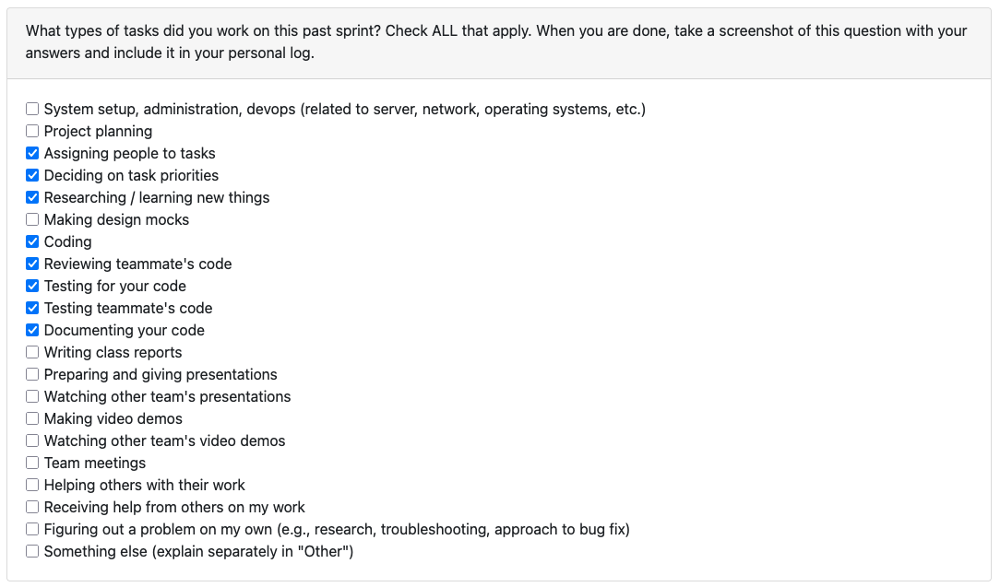
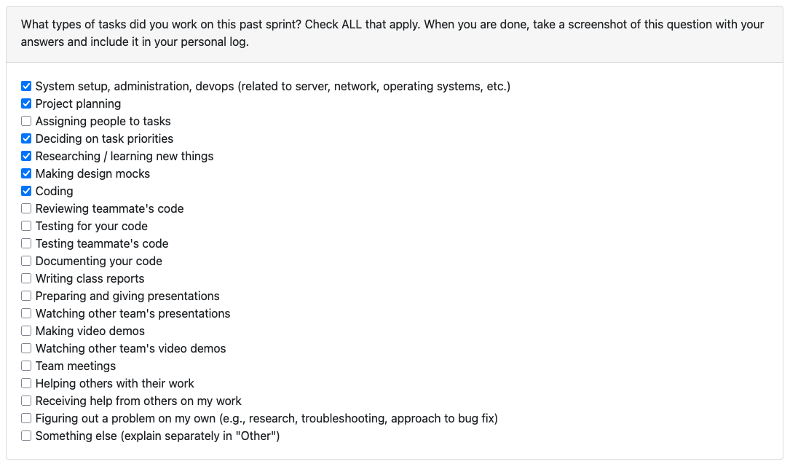
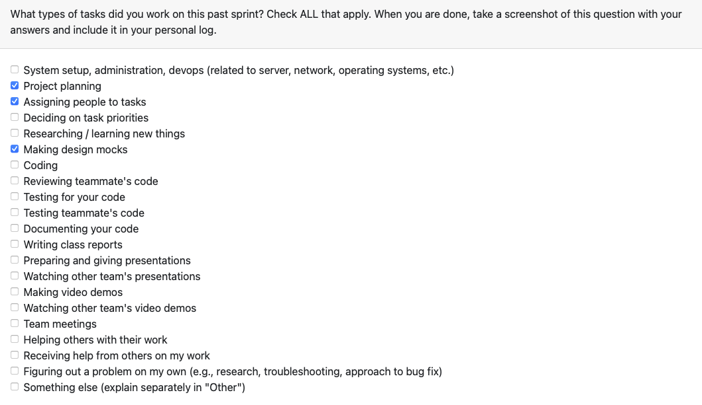
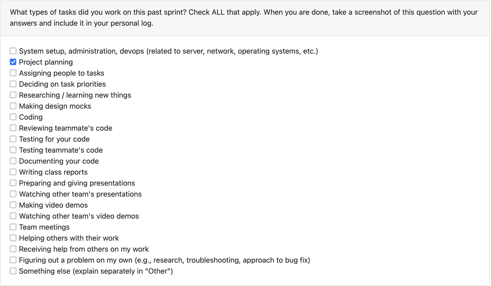

# Joaquin Almora / @joaquinalmora

## Week 8 (October 20th - 27th)
This week I worked on improving the CLI for parsing. I replaced my previous zip shelling with a safe esnure_zip helper that skips files like .venv or node_modules. It also write ZIP64 archives so big asses don't blow up. I refactored so that the CLI has now reusable helpers for the table output display. Added the --relevant-only flag and --code flag. The first one includes only the important files given for a directory, so that in the future the LLM doesn't have to parse through a lot of unnecessary files, and the later one gives the language breakdown for a given project, excluding things like documents and images. It reports per-language file/byte percentages. Everything’s wired through src.cli.parse_zip and scripts/parse_archive.py, and the README documents the new flags with examples. Added tests for the new coverage (language breakdown, auto-zip exclusions), and the updated command passes both manual runs and pytest.

## Week 7 (October 13th - 19th)
This week I spent most of my time building the archive ingestion pipeline for the backend. I started with the main parser in backend/src/scanner/parser.py, setting it up to validate archive paths, make sure files actually exist and end with .zip, and safely handle traversal attempts so nothing escapes its directory. Each file inside the archive now gets turned into a FileMetadata object, and the parser sums up all the bytes and issues into a clean summary at the end. After that, I added some structure to the models by defining FileMetadata, ParseIssue, and ParseResult in backend/src/scanner/models.py using @dataclass(slots=True), just to keep things light and give the parser a clear, predictable contract. I also created specific error types in backend/src/scanner/errors.py (UnsupportedArchiveError and CorruptArchiveError) so we can easily tell when something’s just missing versus actually broken. To make it easier to test things out manually, I wrote a small CLI in scripts/parse_archive.py that can zip up a directory, run it through the parser, and print out a nice readable table or JSON output. Finally, I updated the README.md with some quick usage notes so everyone can try it locally

## Week 6 (October 6th - 12th)
This week I started by trying to automate a burndown chart that would generate based on our GitHub issues, before realizing that GitHub Projects already provides a built-in burnup chart—so I could’ve saved a couple hours if I had just created a project from the start. 
After, I went and created issues for all the past work we've done, so that the burnup chart would be accurate, and also created issues for the new Milestone 1 Requirements that were released this week, and moved everything into our new GitHub project. I also set up the labels to categorize the issues by type, most of them right now are backend, and I also added a story point field to quantify effort and make our burnup chart accurate, since it tracks total points instead of just issue counts. Once that was done, I worked on updating our Level 1 DFD. Some of the main changes included adding a consent gate, splitting the analysis process into local vs. external analysis, keeping the user more involved through the UI loop, and specifying in more detail what data gets transferred into the database. I also refined the process descriptions and made the flow arrows clearer. Finally, I focused on cleaning up our file structure. Jacob had initially set up the directories, so I kept the relevant ones to the current milestone (mostly backend) to avoid clutter and removed redundant or unnecessary files (like the .env file that shouldn’t have been pushed). I then updated the README to reflect the current directory structure and added quick-access links to our main documentation: WBS, DFD diagram, and System Architecture.

## Week 5 (September 29th - October 5th)
This week I worked on the data flow diagram and on fixing our repo structure. On Monday me and my group finished designing the DFD level 0 which was super simple, and we began discussing what our level 1 diagram would look like. Instead of drawing right away, I suggested it'd be better to first define our processes and writing down the interactions between them. At the end of Monday's class we had the diagram on paper (text) and we had used Lucid Chart to draw Level 0 and the first few nodes of Level 1. Before Wednesday's class, I went over the finished version of our diagram and changed the shapes we used to make sure they matched the ones given in the lecture, and printed the diagrams to share with other groups. When we compared diagrams, we noticed that some groups had issues like missing data stores or not reusing the same store across processes, which made their flows harder to follow. Also, during that class I realized we had improperly placed our logs directory in the docs directory, so I spent part of that class moving our stuff into its correct place and making sure everything stayed as is.

## Week 4 (September 22nd - 28th)
This week I worked on creating the first version of our system diagram using mermaid.live. In the next class, I discussed it with other groups and compared our architecture with theirs, which helped me see where our flow wasn’t very clear. After that, we talked as a team about how we were going to split the project proposal, and then I focused on the UML use case diagram and use case scenarios alongside Jacob. Making the diagram readable was a bit challenging with all the arrows and interactions, but we managed to get it done and I added the updated architecture diagram to our repo.

## Week 3 (September 15th - 21st)
This week I worked on defining the requirements and setting up our repo and our Google Drive folder for our documentation, adding the link to it on our README file. Also, I focused on improving our target user group and the usage scenarios. I based off the initial project details given on canvas and worked on turning them into more specific requirements. Then, in class, I discussed with members of other groups about our requirements and theirs, and looked like all groups were more or less on the same page, except most of them had defined a tech stack while we had not.

