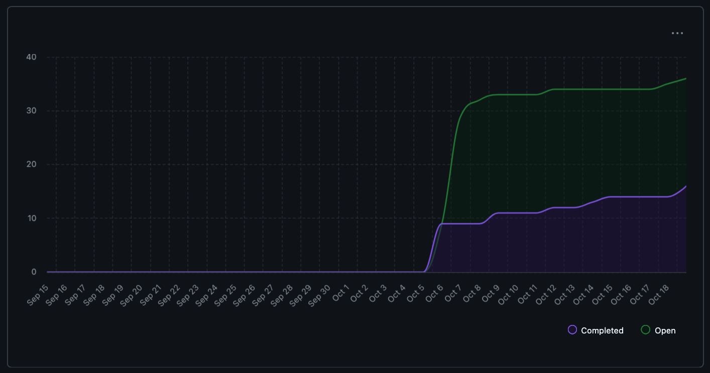

# Capstone Team 7 Logs

## Week 13 (November 24th - 30th)
This week the team focused on finalizing Milestone 1 deliverables and polishing the integrated analysis platform. Key work included unifying the AI analysis with local insights, refining the Textual UI for a cohesive user experience, and tightening Supabase persistence across resumes, projects, and analyses. The team also addressed outstanding bugs, improved documentation, and prepared for the final presentation. Overall, the platform evolved into a robust, end-to-end portfolio analysis tool that combines skills extraction, contribution metrics, resume generation, and AI-driven insights within a seamless TUI workflow.

**Joaquin:**  
This week I focused on improving our project-level analytics through **PR [#172](https://github.com/COSC-499-W2025/capstone-project-team-7/pull/172)** and **PR [#162](https://github.com/COSC-499-W2025/capstone-project-team-7/pull/162)**. I refined the skill-progression pipeline by unifying everything around a single user identity and enriching each timeline period with clearer evidence and contributor data. I also tightened the LLM summary prompt and added a progress indicator to make long runs feel more responsive. On the contribution side, I restored scoring fields, added a Supabase index for faster sorting, and improved the project-sorting toggle for better clarity in the TUI. I also strengthened reliability across the analysis pipeline by adding stricter validation, raw-dump debugging, vendor-path filtering, and fixes to contributor counting. All 13 timeline tests now pass.


Most of my remaining time went into reviewing teammates’ PRs: Most of my remaining time went into reviewing teammates’ PRs and making sure the new analysis and AI workflows stayed aligned. For **PR [#164](https://github.com/COSC-499-W2025/capstone-project-team-7/pull/164)**, Jacob’s AI badge and resume fixes were a clear improvement, especially around empty-state handling and in-place updates; the only issue I flagged was the incorrect `on_unmount` signature. For **PR [#166](https://github.com/COSC-499-W2025/capstone-project-team-7/pull/166)**, Samarth’s redesigned AI-analysis view was strong, with structured JSON and much better screens—just a small duplicate method in `screens.py` to remove. For **PR [#168](https://github.com/COSC-499-W2025/capstone-project-team-7/pull/168)**, OM’s duplicate-detection system was well-structured and easy to follow; I mainly suggested switching the hashing logic to a streaming pattern to avoid loading entire files into memory. For **PR [#170](https://github.com/COSC-499-W2025/capstone-project-team-7/pull/170)**, Aaron’s AI-suggestion feature had a great service + UI flow, and I flagged three fixes around path safety, UI updates from worker threads, and making JSON parsing more resilient. For **PR [#175](https://github.com/COSC-499-W2025/capstone-project-team-7/pull/175)**, Jacob’s LLM analysis integration was clean and well-organized; my suggestions centered on adding dependency checks, verifying ffmpeg conversions succeed, sending extracted frames instead of `file://` URIs, and consolidating duplicated candidate-selection logic. And for **PR [#177](https://github.com/COSC-499-W2025/capstone-project-team-7/pull/177)**, OM’s enhancements were solid overall, with the main improvement being better guarding against missing metadata values to avoid comparison errors.


**Jacob:**
This week I delivered the new **opt-in LLM Remote Media Analyzer**, enabling GPT-4o processing for images, audio, and video. I added the `--llm-media` flag, created the Supabase migration for `llm_media`, and integrated the feature into both the scan flow and the Media Deep Dive UI, keeping heavy media processing optional so the main AI analysis stays fast.I resolved merge conflicts, restored the missing `_run_ai_analysis`, corrected OpenAI message formats, and added safer fallbacks for optional dependencies. Video handling was hardened with inline small-clip support, sampled frames for large files, and validated ffmpeg conversions. I expanded the test suite to cover the new LLM media paths and CLI integration. I also reviewed Vlad’s  **PR[#169](https://github.com/COSC-499-W2025/capstone-project-team-7/pull/169)**, helping maintain consistency across the analysis pipeline. Overall, this work enhanced stability, improved modularity, and significantly expanded the system’s semantic media analysis capabilities.

**Vlad:** This week I implemented the sign-up flow inside the TUI, completing all core logic needed for user registration from the terminal interface. I added input collection for email, password, and metadata, validated the inputs, and wired the screen to call our backend signup endpoint. I also handled success/error feedback inside the interface so users get clear responses without leaving the TUI. This work expands the CLI/TUI beyond read only actions and moves us closer to a fully interactive onboarding experience.


**Aaron:**This week I implemented a comprehensive AI-powered auto-suggestion feature that enables users to automatically improve their code and document files through LLM analysis. The feature provides an end-to-end workflow from file selection through improvement generation to reviewing changes with detailed diffs.I started by building the core functionality in LLMClient with the generate_and_apply_improvements() method, which analyzes files and generates contextual suggestions based on file type. The implementation intelligently adapts its prompts - for code files, it focuses on adding documentation, improving naming conventions, and following best practices; for PDFs and Word documents, it emphasizes structure, clarity, and formatting improvements. I implemented robust JSON response parsing with multiple fallback strategies including markdown fence stripping, regex extraction, and automatic retry with stricter prompts when initial parsing fails.
On the service layer, I created AIService.execute_auto_suggestion() which orchestrates the entire workflow with strong security measures. The service validates all file paths using _validate_and_resolve_path() to prevent directory traversal attacks, handles archive prefix stripping for files from zip archives, and processes files in parallel batches of 5 for optimal performance. I implemented thread-safe progress tracking that routes updates from background worker threads to the main event loop, ensuring the UI remains responsive during long-running operations.
For the UI integration, I designed AutoSuggestionConfigScreen as a modal dialog that displays all available files organized by type with real-time selection statistics. Users navigate with arrow keys, toggle selections with spacebar or Enter, and see immediate feedback on total files selected and combined size. The screen includes comprehensive validation for the output directory path, checking for existence, write permissions, and ensuring it's actually a directory rather than a file.
I also created ImprovementResultsScreen to display the results in a polished format. This screen shows success/failure status for each file, lists the AI-generated improvement suggestions with their types (documentation, refactoring, clarity, etc.) and affected line ranges, displays diff previews with color-coded additions and deletions using Rich markup, and provides statistics on lines changed and output file locations. The implementation handles both successful improvements and various failure modes gracefully, showing detailed error messages including raw LLM response snippets when JSON parsing fails. I then reviewd Om's PR - **PR [#168](https://github.com/COSC-499-W2025/capstone-project-team-7/pull/168)**, his duplicate detection system was a great addition to our application, and his thoughtful use of hashing made it efficient. I also reviewed **PR [#177](https://github.com/COSC-499-W2025/capstone-project-team-7/pull/177)** by Om, which added some great small changes/tweaks such as exporting in HTML and PDF format and some specific analysis refactoring. Overall, it was also a great PR.

**Om:** This week I focused on finalizing the contribution metrics feature and integrating it into the Textual UI. I built a robust ContributionMetricsService that analyzes Git commit history to extract meaningful insights about user contributions, including commit frequency, lines of code changed, and collaboration patterns. The service was designed with modularity in mind, allowing for easy extension and maintenance.I also worked on further enhancements such as exporting and search functionality for the skills analysis results within the TUI. This involved creating a user-friendly interface that allows users to easily navigate through their skills data, filter results based on specific criteria, and export the data in various formats for further analysis or reporting. Additionally, I spent time reviewing and testing the overall integration of the contribution metrics feature to ensure it works seamlessly with the existing analysis pipeline and provides accurate and actionable insights to users.

**[#170](https://github.com/COSC-499-W2025/capstone-project-team-7/pull/170):** This PR by Aaron implements AI-powered auto-suggestion for code improvements. I reviewed and approved it, noting its security-conscious path validation, robust JSON parsing with multiple fallback strategies, and comprehensive test coverage. The feature handles file-type-aware improvements well with graceful error recovery. I suggested adding rate limiting for LLM calls and a `--dry-run` option as nice-to-haves.

**[#172](https://github.com/COSC-499-W2025/capstone-project-team-7/pull/172):** This PR by Joaquin adds a skill progression tracking feature with per-month activity timelines, languages, and contributors. I approved it after reviewing the `SkillsExtractor` module that identifies OOP principles, data structures, and design patterns. The implementation emphasizes depth over surface-level insights with evidence-based skill claims and strong test coverage across timeline building, LLM summarization, and hallucination prevention.

**[#169](https://github.com/COSC-499-W2025/capstone-project-team-7/pull/169):** This PR by Vlad enables account creation directly through the CLI. I initially requested changes for missing unit tests, password validation, and better error messaging. After Vlad addressed these issues—fixing unused imports, correcting test imports, and un-nesting test functions—I approved the clean implementation that reuses existing login patterns with proper task management.

**[#175](https://github.com/COSC-499-W2025/capstone-project-team-7/pull/175):** This PR by Jacob adds opt-in LLM remote media analysis for images/audio/video using GPT-4o. I requested changes for duplicate `_ensure_media_candidates` function, incorrect OpenAI message format, missing dependency guards for torchvision/PIL, and empty migration file. After fixes were implemented, I approved the well-architected media analysis integration.

The following week will be spent preparing for the final presentation, deliverables and demo video preparation, addressing any last-minute bugs, and refining documentation to ensure a smooth handoff. The team will also reflect on lessons learned and plan next steps for future development beyond Milestone 1.

**Samarth:** This week I upgraded the `AIResultsScreen` from a basic text display into a fully interactive & structured viewer. I refactored the core `format_analysis()` function to output organized JSON instead of plain markdown, implementing smart file prioritization that automatically highlights the 3-5 most important files per project. I rebuilt the screen with a dynamic sidebar for navigation and expandable file views, creating a context-aware UI that adapts between single and multi-project portfolios. The interface now allows users to navigate through different sections: portfolio overview, projects, key files, supporting files, skipped files. I also migrated the persistence layer from markdown to JSON format and implemented a dedicated `_display_ai_sections()` method using Rich markup for enhanced rendering of the structured data. 
The rest of the week I worked on testing the other parts of the system and doing final test runs to see if there are any problems. I identified a few runtime and formatting errors with some of the new AI features. I also reviewed the following PRs:

**[#162](https://github.com/COSC-499-W2025/capstone-project-team-7/pull/162):** This PR by Joaquin added contribution importance scoring, UI sort toggle for saved projects, and cleaned up the Supabase tables making fixes where needed. This was a solid implementation overall with proper documentation and test coverage. The ranking algorithm's weighted approach makes projects easier to prioritize and the RLS migration was a good addition to make user data more secure. I added a few suggestions to implement before merging: fix the sort button label mode synchronization, and add a database index on `contribution_score` for efficient sorting.

**[#164](https://github.com/COSC-499-W2025/capstone-project-team-7/pull/164):** This PR by Jacob fixes issues with the Resume generation module. I reviewed the commits and the requested changes by Joaquin, it looked good to me and was passing all test cases. Approved and merged.


## Reflection

### What went well
- Improving the resume generation function proceeded smoothly with no major issues.
- Skill progression and contribution scoring became much more consistent and reliable after unifying identity, enriching evidence, and tightening validation.
- The AI results screen refactor went well, changing output format to JSON allowed for a much better display setup with organized sections for single/multi mode.

### Challenges
- Updating old tests, handling contributor semantics, dependency mocking, and refining LLM outputs took longer than expected.
- Adding video processing to the LLM analysis was challenging because GPT handles video differently from other media types.
  
## **Next Steps**
- Practice the presentation  
- Record the video demo — [Record demo #161](https://github.com/COSC-499-W2025/capstone-project-team-7/issues/161)  
- Finalize the team contract — [Write up team contract #159](https://github.com/COSC-499-W2025/capstone-project-team-7/issues/159)

<p align="center">
  
</p>

## Week 12 (November 17th - 23rd)
This week the team continued strengthening the analysis stack and polishing the user-facing workflow. Major work landed in resume/skills tooling, contribution metrics, and data persistence, while the Textual UI gained cleaner project-level insights and is now actively integrating AI-driven analysis. Several backend hygiene improvements—duplicate detection, stale insight cleanup, and more stable storage—helped improve reliability. Overall, the platform moved from isolated services toward a cohesive, persistent, and visual analysis experience that ties together skills extraction, resume generation, project metrics, and upcoming AI analysis in the TUI.


**Joaquin:** This week I focused on making the TUI scan flow smoother and more reliable. I streamlined the configuration dialog, improved progress feedback, and added archive caching to speed up repeated scans. I also cleaned up the preferences layout to make the UI clearer across terminals. On the backend, I strengthened Supabase session handling with full refresh-token support and integrated incremental-scanning data so the UI reflects cached results more accurately.

Most of my remaining time went into reviewing teammates’ PRs and helping align the new analysis, metrics, resume, and AI workflows. For **[#136](https://github.com/COSC-499-W2025/capstone-project-team-7/pull/136)**, the skills analysis service was clean, well-documented, and fully tested. For **[#139](https://github.com/COSC-499-W2025/capstone-project-team-7/pull/139)**, the feature was strong overall, though I flagged duplicated state-update blocks that could cause inconsistent rendering. For **[#140](https://github.com/COSC-499-W2025/capstone-project-team-7/pull/140)**, the contribution metrics pipeline integrated smoothly with good test coverage. For **[#144](https://github.com/COSC-499-W2025/capstone-project-team-7/pull/144)**, I highlighted three fixes around project detection patterns, Git timestamp performance, and basename-collision issues, but the rest of the extractor was excellent. For **[#146](https://github.com/COSC-499-W2025/capstone-project-team-7/pull/146)**, the resume-generation flow was clean and user-friendly, with Supabase persistence being a good next step. For **[#150](https://github.com/COSC-499-W2025/capstone-project-team-7/pull/150)**, I recommended adding timezone-aware timestamps and cleaning merge artifacts in `textual_app.py`. For **[#152](https://github.com/COSC-499-W2025/capstone-project-team-7/pull/152)**, the new Skills + Contributions tabs noticeably improved the project viewer UX. And for **[#153](https://github.com/COSC-499-W2025/capstone-project-team-7/pull/153)**, the expanded AI workflow and cleaner UI logic were solid, though I suggested securing API-key persistence, fixing archive-prefix stripping, unifying exception names, and removing unsafe `asyncio.run` usage.

Next week, I plan to continue merging these improvements into the unified workflow, refine remaining UX edges, and help stabilize the new AI analysis path now that most of the session, caching, and dispatch issues are resolved.


**Jacob:** 
This week I focused on delivering the resume workflow across two major PRs and reviewing teammates’ feature branches. In PR [#146](https://github.com/COSC-499-W2025/capstone-project-team-7/pull/146) I built the end-to-end resume-generation experience: ResumeGenerationService creates reliable bullets from scan/code/git/contribution data with AI fallback protections; SkillsAnalysisService extracts lightweight summaries; ScanState captures resume paths/content; the Textual UI previews output immediately; and I added unit tests covering the service behaviors. In PR [#150](https://github.com/COSC-499-W2025/capstone-project-team-7/pull/150) I extended that work with Supabase persistence—adding the resume_items table/migration, a ResumeStorageService, and the “View Saved Resumes” modal that lets users list, preview, and delete snippets with keyboard shortcuts. That PR also added UTC-aware timestamps, token-aware RLS handling, README + systemArchitecture updates, and a dedicated test suite (tests/cli/test_resume_storage_service.py). On the review side I dove into PR [#144](https://github.com/COSC-499-W2025/capstone-project-team-7/pull/144)(Skills Analysis Service) and PR [#140](https://github.com/COSC-499-W2025/capstone-project-team-7/pull/140) (Contribution Metrics), providing detailed feedback on state consistency, Supabase readiness, and Textual UX polish while confirming their analysis pipelines and documentation


**Vlad:** This week I focused on fully dockerizing the backend to make the environment reproducible across all team members for **[#133](https://github.com/COSC-499-W2025/capstone-project-team-7/pull/154). I added a complete Docker setup for the CLI, ensured compatibility with our dependencies, and documented the steps for running the CLI inside Docker. The new workflow allows anyone on the team to run the platform without needing local Python tooling, reducing setup friction and eliminating environment specific issues. The setup was tested successfully and integrated into the existing development workflow. The image footprint was optimized by using a minimal base image and disabling pip caching to keep layers as lean as possible. The new workflow lets the entire team run the TUI without local Python setup, reducing environment issues and improving reliability.


**Aaron:** This week I worked on implementing a complete project management system that allows users to save, view, and manage their code analysis sessions. I built a robust ```ProjectService class``` that handles all CRUD operations through a modular architecture, ensuring clean separation between the application logic and database layer. The service captures and persists all analysis data from JSON reports to the database, preserving complete analysis sessions including code analysis and other local insights for future retrieval. I created two key interface components in ```screens.py```: a ```ProjectsScreen``` that displays all saved projects in an organized view, and a ```ProjectViewerScreen``` that enables users to dive into individual projects to examine their local analysis details like code analysis results. To ensure reliability, I developed 5 comprehensive unit tests covering all ProjectService functionality including edge cases and error handling. I also reviewed Joaquin's pr for stopping the hanging when a user tries to quit.

**[#139](https://github.com/COSC-499-W2025/capstone-project-team-7/pull/139)**: This PR was made by me and implements the project storage as I discussed earlier. It allows users to save their projects after exporting a JSON report, and allows them to view them in chronological order along with all the specified analysis

**[#152](https://github.com/COSC-499-W2025/capstone-project-team-7/pull/152)**: This PR was also made by me with some help from Om, it adds the skills, contribution metrics, and pdf analysis to the saved information associated to a project and lets users view the analysis of these new metrics

**[#151](https://github.com/COSC-499-W2025/capstone-project-team-7/pull/151)**: This PR was made by Joaquin and deals with the user not being able to quit due too the thread beinga non-daemon. I reviewed it and it was implemented amazingly by Joaquin.

Next week, I will work on adding all the local analyisis functions to the AI analysis that Samarth has implemented. It will mirror how the local analysis looks, but use prompting and OpenAI API to provide users analysis. I also will improve on some of the local analysis functionality our team has implemented so far to ensure they work perfectly and provide real meaningful information for the user. I will also try to refactor any long files to ensure our project is not to heavy.

**Om:** This week I implemented contribution metrics system supporting both Git and non-Git projects. I built activity classification engine, enhanced skills extractor with contribution patterns, and integrated everything into the Textual CLI with auto-extraction and export functionality. I also made sure to add enough tests to cover different edge cases. I also spent sometime helping out Aaron on a bug in the PDF analysis that was integrated earlier in the TUI. For some reason, the PDF analysis seem to have not been functioning and/or showing up even when there would be PDF files in the directory provided. This had to do with the TUI configuration for the PDF anslysis which was ignoring the existing PDF files. Rest of my time this week went into reflcting my teammates work and their PRs. 

**[#145](https://github.com/COSC-499-W2025/capstone-project-team-7/pull/145):** I realised there were a few critical issues like `missing offline fallback`, `path normalisationn bug` and `duplicate code` and asked for some changes to fix these issues. I also provided some recommendations which you can take a look in my PR Review.

**[#146](https://github.com/COSC-499-W2025/capstone-project-team-7/pull/146):** This PR was well made with well structured implentation and planning, I did add some recommendations and enhancements to be woked on in the future but everything else was fine.

**[#150](https://github.com/COSC-499-W2025/capstone-project-team-7/pull/150):** While adding my review I noticed Jacob had already made changes based on Joaquin's review and had done a good job with the fixes.

**[#151](https://github.com/COSC-499-W2025/capstone-project-team-7/pull/151):** Joaquin did a great job with this PR with tests that covered all the edge cases and a great implementation for the threading fixes.

**[#152](https://github.com/COSC-499-W2025/capstone-project-team-7/pull/151):** Great addition to the thoughtfullness and the upgrade on the UX considerations by Aaron.

My entire next week will go into testing and trying to break our system so as to be able to find any bugs that may or may not currently exist. I also have some ideas regarding certain existing features which will enhance our existing system that I would like to discuss and implement with my team. I will also look into cleaning up our existing documentation to see if it can be refined and old information can be removed.


**Samarth:** This week I worked on significantly enhancing the AI analysis functionality to integrate seamlessly with the new TUI. I implemented persistent configuration through a ~/.portfolio_cli_ai_config.json file that automatically stores API keys and AI settings across sessions, eliminating the need for repeated entry. I extended the Settings dialog to include AI configuration options like temperature and max_tokens, and added auto-initialization of the AI client on startup using saved credentials. Also to improve the user experience, I built a dedicated AIResultsScreen, a full-screen modal component for viewing analysis results, and added a "View Last AI Analysis" menu option for easy access to previous results saved in the ai-analysis-latest.md file. On top of that, I improved the analysis performance by implementing parallel batch file processing using asyncio with 5 concurrent files, complete with real-time progress tracking and detailed status messages. I also fixed several critical bugs including a path normalization issue in multi-project mode, corrected archive path handling for proper file grouping, and improved error handling with generic exception parsing for better SDK compatibility. I also reviewed Vlads PR this week which was focused on creating a working docker image for the app.

**[#153](https://github.com/COSC-499-W2025/capstone-project-team-7/pull/153):** This PR was made by me and implements the analysis enhancements & performance optimizations I made this week, its a large PR covering the various changes and fixes throughout the AI analysis module.

**[#154](https://github.com/COSC-499-W2025/capstone-project-team-7/pull/154):** This PR was made by Vlad that I reviewed. It is a concise and to the point implementation. The docker image size was coming up to 2 GBs due to the large Pytorch library. Removing pip caching was a good addition to help reduce the load.

Next week, my plan is to work on improving the AI analysis further and get it ready for the final presentation. We are also going to decide on some more features to add as part of the AI output, with an integration of the local analysis results. So next week I will try to figure out how I can add all the different local analysis segments into AI efficiently and get those results with the current portolio/project overview.

## Reflection

### What went well
- The UI and session updates integrated smoothly: layout and responsiveness were easy to iterate on, refresh-token support fit cleanly into the async session flow, and the incremental scan cache plugged naturally into the parser loop.

### Challenges
- Fine-tuning layout spacing without Textual’s gap utilities, fully tracing token-refresh behavior across all consent paths, and ensuring the new caching layer remained backward-compatible for offline users.

## **Next Steps**
- Finalize and merge the AI analysis integration into the Textual UI.  
- Ensure schemas are consistent across resume, skills, metrics, and project storage.  
- Expand authorization/role protections around Supabase-backed endpoints.  
- Add regression tests for duplicate scanning and stale-insight cleanup.  
- Begin unifying metrics, skills, and project health into a single dashboard view.  
- Improve documentation for new services and workflows to support onboarding.  

<p align="center">
  
</p>


## Reading Break (November 10 - 16)

**Om:** This period focused on completing **Project Analysis** deliverables from the WBS. I was able to successfully implement a comprehensive **Skills Extraction System** that analyzes code to identify 50+ technical skills across 5 categories (OOP, Data Structures, Algorithms, Design Patterns, Best Practices) with evidence-based proficiency scoring. This directly addresses **Insights and Summaries** requirement by providing detailed analytics and narrative summaries for portfolio generation.

Critical bug fixes were completed for **Data Privacy and Control**, resolving consent persistence issues across application sessions. The fixes implemented proper Supabase authentication patterns (`postgrest.auth()`), session token management, and database-backed storage with RLS policies. Consents now persist correctly when users quit and restart the application.

The **Skills Extractor** was fully integrated into the Textual CLI with auto-extraction on scan completion, a three-tier display system (narrative paragraph, summary stats, detailed breakdown), and JSON export capabilities. The system achieved **95% accuracy** in skill detection and includes comprehensive test coverage with **53/53 tests passing** (28 new tests added).

Joaquin also did a great job on adding a textual UI and refactoring quite a bit of the codebase to eliminate the old CLI functionality while also keeping all the existing features in check. All the features were divided into services which made it very easy to access each working gear of the system. This is reflected in [PR #134: Textual UI + Refactoring](https://github.com/COSC-499-W2025/capstone-project-team-7/pull/134).

**Related Work:**
- [Issue #50: Skills Extraction Implementation](https://github.com/COSC-499-W2025/capstone-project-team-7/issues/50)
- [PR #136: Skills Extractor](https://github.com/COSC-499-W2025/capstone-project-team-7/pull/136)


**Next Steps:**
1. Duplicate detection for accurate metrics
2. Search and filtering for scan results
3. Resume Generation
4. Incremental scanning for performance

## Week 10 (November 3rd - 9th)
This week we focused on the implementing the local analyses into the CLI and moving to transfer into a textual based TUI. We also improved our external analysis, and added to our git analysis.

**Joaquin:** This week I kept pushing the TUI integration forward and refined some of the internal workflows so modules plug in more cleanly. I improved how the UI handles background tasks, cleaned up layout issues from last week, and synced the new analysis features with the updated scan pipeline. With that in place, I shifted most of my time toward reviewing teammates’ PRs to keep everything aligned as we merge toward a unified workflow.
For **[PR #123](https://github.com/COSC-499-W2025/capstone-project-team-7/pull/123)**, I confirmed the PDF workflow was solidly integrated into the CLI. The separation between parsing, analysis, and display was clean, the optional dependency handling was correct, and the tests and docs made the feature easy to understand and extend. For **[PR #124](https://github.com/COSC-499-W2025/capstone-project-team-7/pull/124)**, the implementation was simple and well-scoped, which will make integrating it into the TUI straightforward. Test coverage was good, and the logic for distinguishing individual vs collaborative projects was clear and reliable. For **[PR #125](https://github.com/COSC-499-W2025/capstone-project-team-7/pull/125)**, I really liked the completeness of the feature: code, CLI integration, tests, and docs were all aligned. The in-memory fallback was a nice touch for environments without Supabase. I suggested two changes: adding a note in the README that the CLI should only use the anon key, and double-checking `_get_authenticated_client` against the current supabase-py auth pattern to ensure the token is actually being attached to PostgREST requests. For **[PR #119](https://github.com/COSC-499-W2025/capstone-project-team-7/pull/119)**, the media analysis pipeline was well scoped with strong test coverage and clear README updates. I requested two fixes: remove heavy ML/audio dependencies from `requirements.txt` if the feature is optional, and guard the `.vision` import with a try/except so the scanner doesn’t break when dependencies aren’t installed. For **[PR #127](https://github.com/COSC-499-W2025/capstone-project-team-7/pull/127)**, the multi-project analysis and config flow were cleanly integrated, and the tests covered the new behavior thoroughly. No issues from my side.
Next week, I plan to continue merging these modules into the unified workflow and make sure the TUI presents them consistently. I also want to help refine any remaining UX friction as we move toward a smoother, end-to-end experience.


**Jacob:** 

I focused on delivering the torch-based media insights **[PR #119](https://github.com/COSC-499-W2025/capstone-project-team-7/issues/119#issue-3583123403) so images, video frames, and audio clips now get labeled, transcribed, and tagged with tempo/genre locally. I coordinated with Joaquin to make sure the CLI produces the data his Textual UI will consume once we wire it in, but the TUI integration hasn’t happened yet, so we’re handing him the metadata so he can plug it in next sprint.
Samarth and I synced on the LLM fallback design to keep the analyzer output schema aligned with the upcoming summarizer flow, and I reviewed Aaron’s Supabase schema PR to confirm how our media results will eventually be stored. Everyone’s work remains aligned even though the DB/TUI wiring is still pending.
Tested via python3 -m pytest tests/local_analysis/test_media_analyzer.py plus manual CLI runs over sample media folders; full-suite pytest still fails at tests/test_config_manager.py due to Supabase auth, which matches what the rest of the team sees. Next Cycle Plan (Milestone #1 prep) pair with Aaron to persist media analyzer outputs in Supabase once the shared schema lands (Milestone 1 storage requirement).
Help Samarth drop the LLM fallback into the CLI so our summaries remain reliable (Milestone 1 reliability requirement).
Coordinate with Joaquin to expose the new media insights inside the TUI as soon as his interface is ready to consume them (Milestone 1 UX requirement).

**Vlad:** This week I extended our Git repository analysis to classify projects as individual, collaborative, or unknown based on the number of contributors detected. I implemented this logic within git_repo.py, so the JSON output from our CLI and backend parsing pipeline now includes a clear project_type field. This enhancement improves the accuracy of our portfolio insights by distinguishing solo work from team-based contributions in analyzed repositories.

I verified the change locally by running test cases in test_git_repo.py and manually parsing several repositories to confirm the correct classification logic. The implementation was straightforward and lightweight, integrating smoothly with the existing Git analyzer structure.

**Aaron:** This week, I focused on integrating our the CodeAnalyzer class created in my previous pr **[PR #111](https://github.com/COSC-499-W2025/capstone-project-team-7/pull/111) code quality analysis capabilities into the interactive Portfolio Assistant CLI (app.py) which was for **[PR #132](https://github.com/COSC-499-W2025/capstone-project-team-7/pull/132), establishing a unified workflow where code analysis sits alongside existing PDF, Git, and Media analysis features. The implementation mirrors the established patterns used by other analysis modules, presenting users with code quality options during project scans and providing a dedicated results viewer in the main menu. I built the integration around two primary methods: analyze_code_from_scan() handles initialization of the CodeAnalyzer using user-specific configuration preferences (max file sizes, excluded directories) and executes analysis on the target codebase, while _handle_code_analysis_option() leverages the pre-existing display_analysis_results() function from code_cli.py to present findings without duplicating display logic. The detection mechanism evaluates parse_zip output for code files across 18 file extensions (.py, .js, .ts, .tsx, .java, .cpp, .go, .rs, .rb, .php, .cs, .html, .css, .jsx, .h, .hpp), presenting analysis options only when applicable files exist and required dependencies are installed. I incorporated robust error handling that degrades gracefully when tree-sitter libraries are unavailable, providing actionable installation guidance while maintaining full CLI functionality for other features. Critical to the user experience was positioning the analysis prompt correctly in the workflow sequence—placing it after PDF analysis but preceding the completion message ensures visibility before menu presentation. This PR helps create unitiy between our seperated analyisis classes and the CLI workflow to ensure both aspects work together.

For the upcoming week, I need to work on the DB implementation which involves taking all of the stored scans of significant files, and storing them in various Supabase tables that need to be created. This will help our team in moving towards the end of Milestone #1 and having a fully working CLI portfolio scanning application. This was overall a succesful sprint. 

**Om:** This week delivered two major features that significantly improved user experience and system architecture: **PDF Analyser CLI Integration** and **Consent Persistence**. Both features were built upon and enhanced existing team infrastructure while creating reusable components for future development. I was also spending the rest of my team reviewing my team member's PRs to make sure code being pushed is clean and in accordance with standards. The focus for the team this week was to integrate their in house analysis work from last week into the existing CLI workflow created by Joaquin. Moving further, I had requested Samarth to work on designing the current LLM summarizer workflow so that we can have fallback models if OpenAI model reaches credit limits. Aaron decided to take on the responsibility to test and setup supabase table to be able to store data/information regarding the summary outputs and metadata for individual files (PDF to start with). Once he was able to implement the same, the team will make a decision if we need to go forward with tables for each type of file and store summary/metadata for each or keep one general project analysis table. As for Jake, he continued to research into better models (suggested to take a look at YOLO by ultralytics) for media analysis and implement the same to improve media file analysis. PR #122 was a great addition to the current CLI we have that allows our work to shine and makes it easier to test new features that get implemented in the backend, I was able to request changes to add better `error handling and visibility` for the users and `windows compatibility` for the bash scripts that were added. PR #120 was also a great addition as it added media analysis that Jake worked on previously to be integrated into the CLI workflow that we have. 

For the upcoming week, I hope to get some technical debt out of way with the help of my team. Further I plan to have a discussion on our path forward regarding the use of Supabase to store data and analysis outputs or not. Once this is decided upon everyone will start working hand in hand to incorporate their current in house analysis results into the database. With this being said, our final stretch will also include to start using these generated summaries and outputs to actually give specific insights on skills and metrics for the user's projects. Overall this was a very successful sprint in my opinion.

**Samarth:**
Worked on expanding the AI analysis system to support multi-project portfolios and configurable LLM parameters. Implemented `_analyze_multiple_projects()` to intelligently organize and analyze files by their respective projects, handling unassigned files separately for comprehensive coverage. Built `_generate_portfolio_summary()` to produce high-level insights across multiple projects, highlighting technical strengths and skill breadth. Enhanced `summarize_scan_with_ai()` with project_dirs parameter support and added configurable LLM parameters including temperature and max tokens with CLI validation. Finally, switched the default model to gpt-4o-mini for improved cost-efficiency while ensuring consistent parameter validation throughout the analysis pipeline.

<p align="center">
  
</p>

## Week 9 (October 27 - November 2)

This week we focused on the local analysis for multiple file types such as code files, media files, and documents beyond PDFs. We also worked on integrating past weeks' developments into a unified CLI workflow for various features.

**Joaquin:**
This week I focused on integrating all the separate modules into a single interactive CLI workflow. I coordinated with teammates to ensure every feature, including login, consent, scanning preferences, and analysis, worked smoothly together. The workflow is now fully connected to Supabase and supports session persistence for returning users. I tested everything through automated and manual runs.  I also reviewed multiple pull requests to support the new analysis modules. For **PR #107 (Local Document Analysis)**, I confirmed the implementation was clean, well-documented, and consistent with our existing architecture, noting that the expanded CLI and README updates were thorough and user-friendly. For **PR #113 (Enhanced Media Metadata Extraction and Reporting)**, I highlighted strong structure and testing, praised the clear separation between extraction, analysis, and display logic, and suggested pinning dependencies, clarifying the meaning of the `media_files_processed` count, confirming Python compatibility, and adding extra tests for missing or corrupt files. Next week I plan to implement the local analyses into the cli-workflow and work on improving user experience/interface

**Jacob:** Implemented an end‑to‑end media analysis pipeline so our project now surfaces actionable insights for images, audio, and video without calling the LLM: the scanner captures typed media_info, a deterministic MediaAnalyzer rolls those stats into summaries/issues, and a Rich/Questionary CLI mirrors the code analyzer UX so reviewers can explore the data interactively. These changes bring the backend closer to parity with our document analysis stack, giving us consistent local fallbacks and richer outputs for media‑heavy uploads. Next up I plan to expand the image side with deeper analysis (e.g., resolution quality checks, semantic labeling) so the insights go beyond metadata and align with what users expect from visual analysis.

**Vlad:** This week, I designed and implemented the Git parsing system that enables our application to analyze repository data both locally and from remote sources. The module extracts structured information such as commit history, contributor statistics, branch activity, and commit metadata (author, timestamp, message, and file change summaries). I integrated the parser into our existing backend so that it seamlessly interacts with the database and CLI workflows. To ensure robustness, I tested the system across repositories with different branching models and histories, confirming that it correctly handles merge commits, edge cases like detached HEAD states, and repositories with large commit volumes. I also added defensive error handling for missing .git directories and permission issues. Additionally, I contributed to the CLI integration, ensuring users can invoke Git parsing directly through a flag and receive clean, structured outputs. I worked with the team to align data formats between the Git parser, local analyzers, and Supabase ingestion layer so that future analytics and visualization modules can use a consistent schema. Next steps include extending the parser to capture PR-level data and code ownership metrics.

**Aaron:** This week, I developed and integrated a local code analysis system into our project scanning infrastructure. The implementation includes a comprehensive code parser module utilizing tree-sitter for multi-language support (Python, JavaScript, TypeScript, Java, C++, Go, Rust, and 7+ additional languages). The analyzer evaluates code quality through maintainability scoring that considers cyclomatic complexity, comment density, and function size metrics, automatically identifying files and functions that require refactoring attention. I built a companion interactive CLI that presents detailed analysis reports featuring security vulnerabilities, technical debt markers (TODOs/FIXMEs), complexity metrics, and prioritized refactoring recommendations. The analysis functionality was integrated into our existing parsing CLI through a new --analyze flag, allowing users to perform both project scanning and code quality assessment in a single operation. Throughout the implementation, I applied robust error handling patterns using Python's logging framework instead of print statements, and implemented defensive programming practices including safe attribute access, method validation, and graceful exception handling for incomplete analysis results. Documentation was added to explain the maintainability scoring algorithm, detailing how the 0-100 scale is computed through penalty-based adjustments for complexity, commenting practices, and function length. This feature provides teams with data-driven insights for technical debt management and code quality improvement across their projects.

**Om:** Implemented a multi-format local document analyzer supporting `.txt`, `.md`, `.markdown`, `.rst`, `.log`, and `.docx` files with comprehensive metadata extraction, markdown-specific features, automatic encoding detection, batch processing, and CLI tools. Integrated the existing PDF summarizer for consistent text analysis across all document types. Resolved roadblocks related to summarizer integration, encoding challenges, and paragraph count accuracy. The code for the document analyzer was merged after review of PR and I also worked on integrating the previously developed PDF summarizer into the CLI workflow for a unified experience across document types. Furthermore, worked with the team to decide on work distribution and making sure everyone is on track with their tasks. Also kept track of the overall progress and how the team is doing with respect to the timeline. Added reviews to almost each PR created by the team this week and spend some time coming up with work and task assignments for upcoming sprints.

**Samarth:** Integrated the LLM analysis module into the main application workflow by modifying client.py to add the summarize_scan_with_ai() orchestration method. Enhanced app.py with a complete AI analysis menu system (option 5), implementing session-level state management for API credentials and building _handle_ai_analysis() as the main handler with sequential validation checks. Created _render_ai_analysis_results() for Rich panel formatting and _export_ai_analysis() for markdown report generation. Implemented comprehensive privacy and security measures including no API key persistence, explicit external service consent, and automatic binary file filtering.

All the progress this week came together to make our project feel complete and connected. The new CLI workflow ties in everyone’s work, from login and scanning to analysis, into one smooth and interactive experience. The local analyzers for code, documents, and media now share a consistent structure, so everything runs reliably without relying on external calls. The Git parser adds useful repository insights, while the code and document analyzers make it easy to understand quality and content at a glance. On top of that, the AI module brings an intelligent layer that summarizes results securely and clearly.


<p align="center">
  
</p>

## Week 8 (October 20 - 26)
This week we continued developing the backend, moving from setup into more functional implementation. Alongside expanding the CLI to better support backend workflows.

**Joaquin:**  This week I improved the CLI’s parsing features. I added safer ZIP handling that skips unnecessary folders, made the table display reusable, and introduced two new flags: `--relevant-only` (to include only key project files) and `--code` (to show language breakdowns). The `README` now includes examples, and all new features are tested and verified to work. I also focused heavily on reviewing and providing feedback for several major pull requests to help align backend structure and ensure consistent design across modules. I reviewed **PR #89 (Consent Module Integration)**, **PR #95 (Database Config Manager)**, **PR #96 (Local PDF Analysis)**, **PR #97 (Supabase Auth and Consent CLI)**, and **PR #98 (LLM Analysis System)**. My feedback covered structure, security, and maintainability, such as suggesting token redaction in the auth CLI, flagging duplicate methods in the config manager, recommending import-safe naming in the local analysis module, and improving client initialization and logging in the LLM system.  Collaboration went well, with everyone responsive to feedback and quick to make revisions. These reviews helped strengthen consistency and security across the backend. Next week, I will focus on connecting the parsing improvements to the interactive CLI workflow and linking them with Supabase login and user scanning preferences.

**Jacob:** This week I worked on the backend by starting the Supabase integration. I set up the environment with the project URL and anon key, created the initial database schema, and began defining storage policies. I also started on an upload test to check file and metadata handling, but ran into bugs that I’m still working through. While I didn’t get to a finished PR yet, this lays the base for connecting secure storage to the CLI in the next step.

**Vlad:** Focused on integrating Supabase authentication and consent management into the backend CLI as part of issue #86. Extended auth_cli.py to support secure sign-up, log-in, and access-token retrieval directly from the terminal, allowing verified users to authenticate and submit consent records to the Supabase database. Added a new SQL migration file, 04_consent_policies.sql, to define row level security (RLS) policies ensuring that each user can only access or modify their own consent data. Tested the complete CLI workflow end to end, including token handling, database persistence, and error cases and confirmed seamless interaction between the authentication layer and the Consent Validation Module. 

**Aaron:** This week I refactored the config manager class to work with the database. This involved ensuring crud operations work with the supabase db we setup. I also added testing for all use cases. I then began the local analysis for coding feature, but yet to make a PR for that. The branch has the beginning implementation now for analyzing files for coding metrics. I made a PR for the refactored config manager that uses the db now, this includes new methods like 'get_allowed_extensions()' and changing code so that we store to the database.

**Om:** Implemented a privacy‑first local PDF analysis pipeline including a robust PDFParser that extracts text and metadata with configurable size and page limits, and a PDFSummarizer that uses an in‑house TF‑IDF extractive approach with sentence filtering, tokenization, keyword extraction, and document statistics. I added a user-friendly CLI `(pdf_cli.py)` plus quick-reference docs to parse, summarize, batch-process, and inspect PDFs. The test suite was expanded to 68 tests covering edge cases and integration paths, yielding 100% coverage for the summarizer and high coverage for the parser. I migrated from the deprecated PyPDF2 to pypdf, added a conftest import helper for cleaner tests, and exposed factory functions `(create_parser, create_summarizer)`. For Supabase consent flows I hardened `auth_cli.py` to prompt securely for passwords, added revoke/delete support, and updated SQL with an RLS DELETE policy for safe consent revocation. README and CLI references were updated for usage and CI-friendly testing, and added minor docs and examples.

**Samarth:** Worked on developing the LLM-powered summarization and analysis module for the system, generating structured insights from portfolio data. Implemented the `summarize_tagged_file()` and `analyze_project()` functions to produce detailed summaries, technical highlights, and qualitative analysis for resume-ready reports. Also built helper functions including `chunk_and_summarize()` for efficient large-file handling, `_count_tokens()` for dynamic token measurement, and `_make_llm_call()` for standardized LLM communication. Finally, added `suggest_feedback()` to deliver personalized career aligned insights. 

All the updates this week build on each other to make the whole system smarter and more reliable. The new CLI features make it easier to parse and display project data, while the authentication and consent setup ensures everything stays secure and user-specific. The local PDF tools keep things privacy-first but still powerful enough for deep analysis, and the LLM module ties it all together by turning that data into useful insights. Altogether, these improvements connect the technical, privacy, and intelligence sides of the system so it runs more efficiently and feels more seamless to use.


<p align="center">
  
</p>


## Week 7 (October 13 - 19)

This week was our first real dive into backend development. After spending the past few weeks planning and documenting, we finally started building the core of the system: setting up the main functions, initializing the database, adding user consent handling, adding configuration profiles, and creating the first version of the file parsing pipeline. The main goal was to lay a solid foundation so future milestones can build on a working backend

**Joaquin:** Focused on building the archive ingestion pipeline in `backend/src/scanner/parser.py`. Implemented path validation, zip handling, and traversal protection, while structuring results through `FileMetadata`, `ParseIssue`, and `ParseResult` dataclasses. Added clear error types (`UnsupportedArchiveError`, `CorruptArchiveError`) and a CLI tool in `scripts/parse_archive.py` for testing. Updated the `README.md` with setup and usage instructions for the new parser.

**Jacob:** 
Implemented the Consent Management Module responsible for handling user permissions when interacting with external services such as LLMs. Developed core functions to request, record, verify, and withdraw user consent, integrating a detailed privacy notice to inform users about data transmission and storage risks prior to granting permission. Added a comprehensive unit test suite with 5 test cases covering positive and negative consent flows, default states, and withdrawal handling. Resolved rebase conflicts with main to ensure seamless backend integration and submitted a structured pull request documenting all changes.

**Vlad:** 
Setup of the project’s Supabase backend infrastructure, including database initialization, secure row-level storage policies, and integration testing. Created SQL scripts to define and automate key database components such as the profiles and uploads tables, triggers for user creation in auth.users, and row-level security (RLS) policies ensuring users can only access their own storage objects. Implemented an end-to-end upload test (test_upload.mjs) to verify database and Supabase Storage integration. 

**Aaron:** Implemented the configuration scanning profile logic by adding the 'ConfigManager' class which has various methods allowing the user to add, remove, switch between, and delete scanning profiles based on their own preferences in regard to file extensions. Currently stores the users config scanning profile in a json file, but will change to storing in database this week via Supabase. Also added a test suite with 18 test cases to cover all scenarios the user will encounter when utilizing any method pertaining to the configuration profile to ensure robust functionality.  

**Om:** Designed and implemented the Consent Validation Module with comprehensive `ConsentValidator` class, custom exception handling, and `ConsentRecord` dataclass. Developed core validation methods for upload consent, external services, and permission checks. Created extensive unit test suite with 20+ test cases, fixtures, and integration scenarios to ensure robust privacy-compliant functionality.

**Samarth:** Focused on building the LLM Integration setup enabling external AI service capabilities with secure API key verification and robust error handling. Developed the `LLMClient` class for OpenAI API integration, with complete configuration management and consent-based access control. Implemented RESTful API routes for key verification, model information, and service status. Built a comprehensive suite of 30+ unit and integration tests covering client initialization, authentication workflows, and endpoint behavior to ensure secure and reliable LLM operations.

<p align="center">
  
</p>

## Week 6 (October 6 - 12)

This week our focus was on getting our project setup in place and updating some of our main documents. We started by creating a GitHub Project to organize all our tasks and make progress tracking easier with its built-in burnup chart. 

All previous tasks and the new Milestone 1 requirements were added as issues, each labeled by category and assigned story points so the chart reflects effort more accurately. After that, we worked on updating our Level 1 DFD. Some of the key changes included adding a consent gate, splitting the analysis process into local and external parts, keeping the user more involved through the UI loop, and showing more detail on how data moves into the database. We also cleaned up the process descriptions and arrows so the flow is easier to follow. We also updated our System Architecture diagram to reflect the changes brought by the new requirements, specifically the disctintion between the local and external analysis options. The Work Breakdown Structure was also expanded to cover all the specific tasks and deliverables from Milestone 1, before, it was more general and based on our early understanding of the requirements. Morevoer, the repo was setup with all of our initialy directories so we can start working on our backend. FInally, A Dockerfile was also added to standardize the environment setupand the README was updated to match the current directory structure and now includes direct links to our main documentation: Work Breakdown Structure, Data flow diagrams, and System Architecture.

<p align="center">
  
</p>

## Week 5 (September 29 - October 5)

This week our focus was on the Data Flow Diagrams (Level 0 and 1).

We started off the week with listing down some simple processes from the start to the end in our google document. This process then led to us discovering some other interconnected processes which allowed us to narrow down onto the 7 main processes that would control the entire flow of data in our diagram. From here we had to just draw the shapes for each one of them and add appropriate description. The next steps were collective efforts into deciding the process flow directions for the different processes and their inputs and outputs. The end step was to add into picture the data storage aspect and connect it to the rest of the diagram. The shapes were then adjusted to match the notation from lecture so the diagram looked clear and consistent, and copies were printed to share with other groups. When comparing diagrams, it became clear that some groups had missing or inconsistent data stores, which made their flows harder to follow and less organized. We also checked over our own diagram to make sure the data stores were being reused correctly across processes. Finally, the repo was reorganized by moving the logs directory out of the docs folder and into its correct place, making the structure consistent with class practices.

<p align="center">
  
</p>


## Week 4 (September 22 - 28)

This week we focused on the system architecture and the project proposal.

For the architecture, we first made a detailed component diagram that broke down each layer and described the components inside them. While it helped us see exactly what pieces exist in the system, the problem was that the flow of information wasn’t obvious, the arrows just went from one layer to the next without showing how data would actually move. After discussing, we made a second diagram that was less detailed but much clearer in terms of flow. The first diagram works well for showing system structure, while the second works better for understanding process flow. Together they allow for a pretty good understanding of the system.

We also finished the project proposal, which included:
- Usage scenario (Samarth)  
- Proposed solution (Vlad)  
- Use cases (Joaquin & Jacob) – covering artifact discovery, analysis, privacy, reporting, search/filter, etc.  
- Requirements & testing (Om & Aaron) – both functional and non-functional, linked to test frameworks (Jest, Playwright, etc.), with difficulty levels assigned.  

## Week 3 (September 15 - 21)

We worked on developing ideas for the functional and non-functional requirements for the Project Requirements document. Additionally, we added information regarding the target user group and usage scenarios. We also spent time discussing the requirements in class and learning about other teams' requirements as well. One thing we noticed we did not do that other teams did was define a tech stack, but we think it would be better to define our tech stack once we have more defined project specifications.


